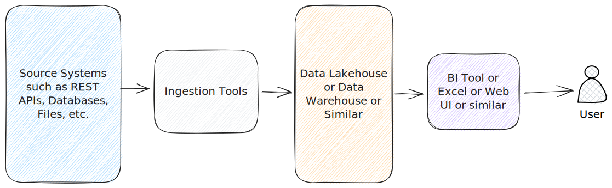
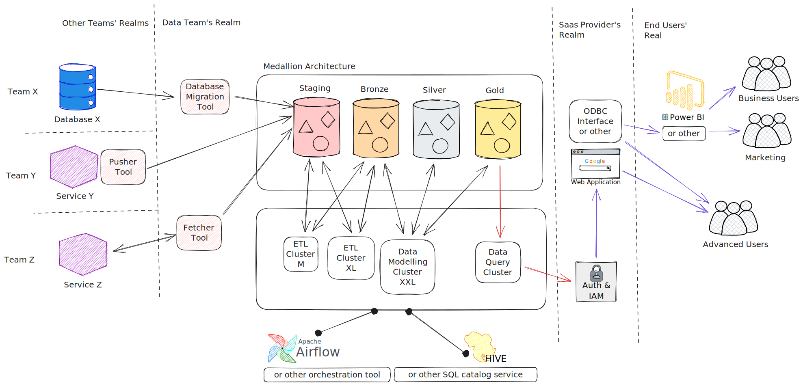
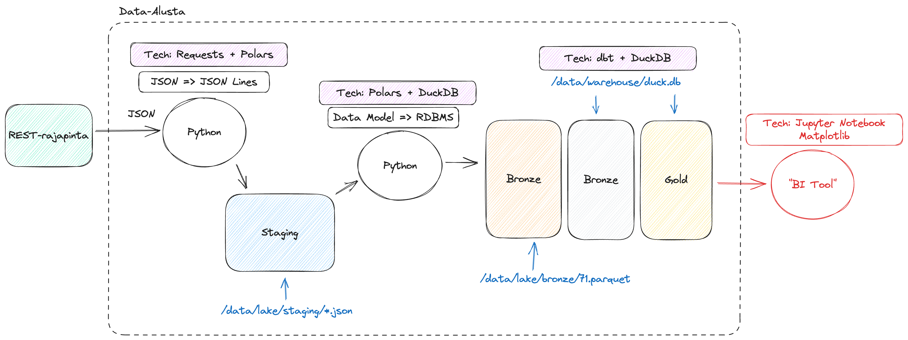

On tärkeää muistaa, että data-alusta ei ole yksittäinen tuote vaan kollaasi eri työkaluja. Loppukäyttäjän näkökulmasta alusta voi olla _"se meiän firman power bi"_, mutta todellisuudessa kokonaisuus koostuu useista eri työkaluista. Lisäksi eri yritysten data-alustat voivat olla keskenään hyvin erilaisia. Yrityksellä voi olla yksi monoliittinen, keskitetty tietoalusta, tai hyvinkin hajautettu data-alustojen patteristo.

## Yleisnäkymä

**Kuvio 1:** _Karkea 50,000 jalan näkymä data-alustan arkkitehtuuriin._

Yllä olevan graafin (Kuvio 1) komponentit ovat vasemmalta lukien:

- **Sininen**: Lähdejärjestelmät (source system)
    - Datan alkuperäiset lähteet, kuten operatiiviset tietokannat.
- **Hopea**: Sisääntuonnin työkalut (ingestion tools)
    - Kerros, joka louhii tai vastaanottaa datan tietoalustaan.
- **Oranssi**: Toistaiseksi mustana laatikkona nähty kokonaisuus, joka sisältää tallennuksen ja laskennan (eng. storage & compute.)
- **Violetti**: Datan tarjoilukerros (eng. serving layer) on loppukäyttäjän näkymä dataan. Tyypillinen esimerkki on BI-työkalu kuten Power BI, Qlik tai Tableau, mutta kyseessä voi hyvin olla myös käyttötarpeeseen räätälöity verkkosivusto (esim. Plotly, JavaScript D3, React) tai suoraa kantayhteyttä muistuttava connector (esim. ODBC connector). Tietoalusta voi myös puskea dataa ulos, jolloin sitä ei ylipäätänsä noudeta, vaan se syötetään järjestelmään X.
- **Ihmisfiguuri**: Tietoalustan loppukäyttäjä. Heidän tarpeitaan varten koko alusta luodaan. Loppukäyttäjiä voi olla useita erilaisia, kuten myynti, ylin johto, tutkimus ja tuotekehitys, ohjelmistonkehittäjät, tietoturva-asiantuntijat, ja niin edelleen.

## Hieman lähempi näkymä

**Kuvio 2**: _Edellistä kuviota yksityiskohtaisempi 30,000 jalan näkymä data-alustan arkkitehtuuriin._

Huomaathan, että yllä olevassa Kuvio 2:ssa on jo valittu tiettyjä palveluita esimerkeiksi. Data-alustan **ei ole pakko** käyttää medaljonkiarkkitehtuuria (bronze, silver, gold) eikä mitään muutakaan yksittäistä valittua tuotetta. Työkalut ovat esillä liiallisen abstraktion välttelemiseksi.

## Anti Big Data

### Yhden noden arkkitehtuuri: DuckDB

Tähän lisää tekstiä myöhemmin. Esimerkki DuckDB-tyylisestä alusta, jossa kaikki data mahtuu yhden tietokoneen rammiin vähintään paloiteltuna.

**Kuvio 3**: *Yhden koneen data-alusta*

!!! question "Tehtävä"

    Vertaa yllä esiteltyä alustaa Christophe Blefarin [Fancy Data Stackiin](https://www.blef.fr/the-fancy-data-stack/). Kuinka paljon yhtäläisyyksiä ja eroja löydät?

## Pro Big Data

### Hajautettu arkkitehtuuri: Databricks Lakehouse

TODO: Selitä tämä.