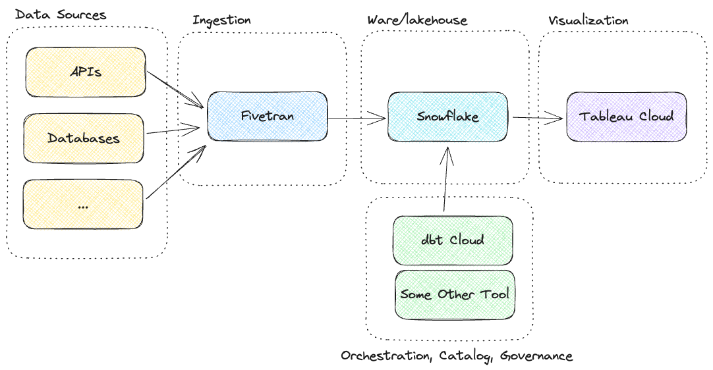
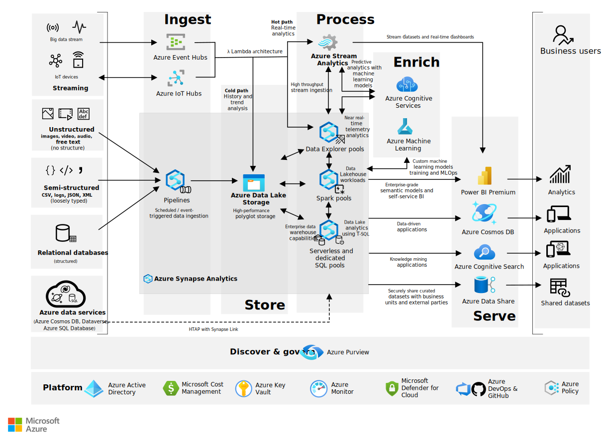
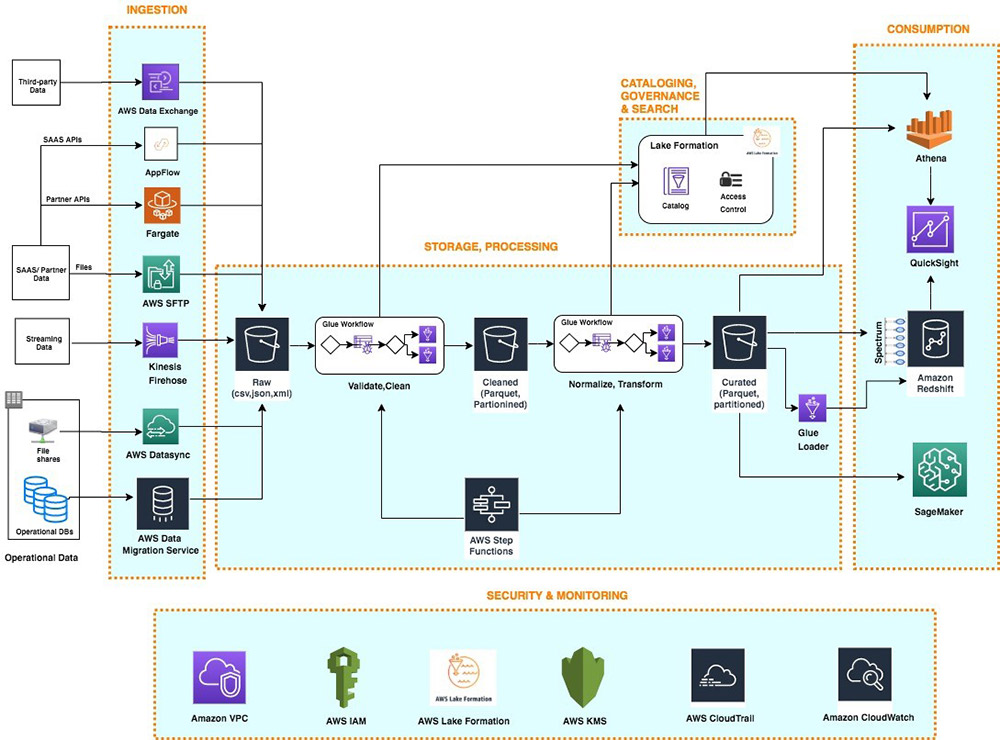
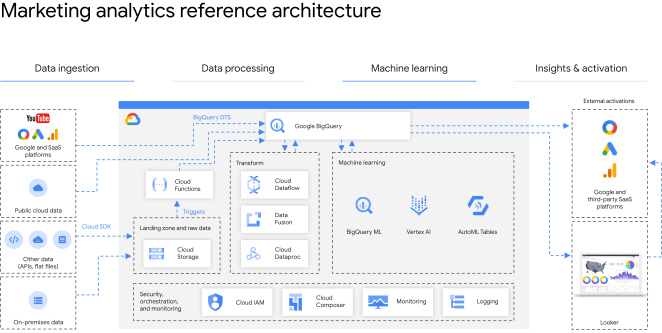

On tärkeää muistaa, että data-alusta ei ole yksittäinen tuote vaan kollaasi eri työkaluja. Loppukäyttäjän näkökulmasta alusta voi olla _"se meiän firman power bi"_, mutta todellisuudessa kokonaisuus koostuu useista eri työkaluista. Lisäksi eri yritysten data-alustat voivat olla keskenään hyvin erilaisia. Yrityksellä voi olla yksi monoliittinen, keskitetty tietoalusta, tai hyvinkin hajautettu data-alustojen patteristo.

## Yleisnäkymä

### 50,000 jalan näkymä

**Kuvio 1:** _Karkea 50,000 jalan näkymä data-alustan arkkitehtuuriin._

Yllä olevan graafin (Kuvio 1) komponentit ovat vasemmalta lukien:

- **Sininen**: Lähdejärjestelmät (source system)
    - Datan alkuperäiset lähteet, kuten operatiiviset tietokannat.
- **Hopea**: Sisääntuonnin työkalut (ingestion tools)
    - Kerros, joka louhii tai vastaanottaa datan tietoalustaan.
- **Oranssi**: Toistaiseksi mustana laatikkona nähty kokonaisuus, joka sisältää tallennuksen ja laskennan (eng. storage & compute.)
- **Violetti**: Datan tarjoilukerros (eng. serving layer) on loppukäyttäjän näkymä dataan. Tyypillinen esimerkki on BI-työkalu kuten Power BI, Qlik tai Tableau, mutta kyseessä voi hyvin olla myös käyttötarpeeseen räätälöity verkkosivusto (esim. Plotly, JavaScript D3, React) tai suoraa kantayhteyttä muistuttava connector (esim. ODBC connector). Tietoalusta voi myös puskea dataa ulos, jolloin sitä ei ylipäätänsä noudeta, vaan se syötetään järjestelmään X.
- **Ihmisfiguuri**: Tietoalustan loppukäyttäjä. Heidän tarpeitaan varten koko alusta luodaan. Loppukäyttäjiä voi olla useita erilaisia, kuten myynti, ylin johto, tutkimus ja tuotekehitys, ohjelmistonkehittäjät, tietoturva-asiantuntijat, ja niin edelleen.

### 30,000 jalan näkymä

**Kuvio 2**: _Edellistä kuviota yksityiskohtaisempi 30,000 jalan näkymä data-alustan arkkitehtuuriin._

Huomaathan, että yllä olevassa Kuvio 2:ssa on jo valittu tiettyjä palveluita esimerkeiksi. Data-alustan **ei ole pakko** käyttää medaljonkiarkkitehtuuria (bronze, silver, gold) eikä mitään muutakaan yksittäistä valittua tuotetta. Työkalut ovat esillä liiallisen abstraktion välttelemiseksi.

## Datan määrä

### Anti Big Data: DuckDB

Kaikki eivät niele täysin purematta big datan tarpeellisuutta kaikissa maailman yrityksissä. Tästä 2023 vuoden näkyvimpänä esimerkkinä on MotherDuck-yrityksen yhden noden kolumnaarinen OLAP-engine nimeltään [DuckDB](https://duckdb.org/). DuckDB ei siis ole tietokanta vaan Apache Sparkin kaltainen laskenta-engine. Tietokanta voi kuitenkin olla tiedostossa (esim. `db.duckdb`.)

Huomaa, että 50,000 jalan päästä katseltuna kaikki arkkitehtuurit näyttävät yllättävän samalta. Periaatteessa DuckDB:n arkkitehtuuri on myös vähän lähempääin katseltuna yllättävän samanlainen kuin modernien tietoalustojen "big data"-versionsa. Yllä esitelty 30,000 jalan näkymä on hyvinkin toteutettavissa DuckDB:n avulla.

!!! question "Tehtävä"

    Lue MotherDuckin Jordan Tiganin kirjoitus [Big Data is Dead](https://motherduck.com/blog/big-data-is-dead/). Mihin Jordan perustaa väitteensä?

!!! tip
    DuckDB on oikeasti olemassa oleva projekti, joka on julkaistu avoimen lähdekoodin lisenssillä. DuckDB on SQL-tietokanta, joka on suunniteltu toimimaan yhdellä tietokoneella. DuckDB on myös yksi esimerkki siitä, että data-alustan ei tarvitse olla monoliittinen, vaan se voi koostua useista eri työkaluista.

Alla esimerkki DuckDB-tyylisestä alusta, jossa kaikki data mahtuu yhden tietokoneen rammiin vähintään paloiteltuna. Huomaa, että arkkitehtuuri ei loogisella tasolla eroa kovinkaan paljon esimerkiksi yllä olevasta 30,000 jalan näkymästä, vaikka fyysisellä tasolla ero onkin merkittävämpi (yksi tietokone vs. monta hajautetun laskennan klusteria.) Kuvan alusta on jotakin, mikä on täysin tehtävissä 3 opintopisteen kurssin aikana.

**Kuvio 3**: *Yhden koneen ja yhden tietolähteen data-alusta. Alustaa on helppo jatkaa suuremmaksi. Siihen voi tuoda uusia tietolähteitä, siirtää laskennan pilveen, siirtää tallennuksen pilveen, vaihtaa BI-työkalun, ottaa orkestrointiin dbt Cloudin ja/tai Airflow:n. Oikein käytettynä alustasta voisi olla hyvinkin realistista bisneshyötyä.*

!!! question "Tehtävä"

    Vertaa yllä esiteltyä alustaa Christophe Blefarin [Fancy Data Stackiin](https://www.blef.fr/the-fancy-data-stack/). Kuinka paljon yhtäläisyyksiä ja eroja löydät?

### Pro Big Data: Muut

Mikäli voidaan olettaa, että dataa on paljon, ja että dataa on useista eri lähteistä, on todennäköistä, että dataa ei voida tallentaa yhdelle koneelle (esim. `db.duckdb`-tiedostoon). Vaikka data hajautettaisiin pilvipalvelun tarjoamaan loputtamasti skaalautuvaan tallennustilaan eri tiedostoihin partitioituina, sen prosessointi yhdellä koneella ei välttämättä ole realistista. Tällöin tarvitaan hajautettua laskentaa. Hajautettu laskenta käsitellään [Kerrokset/Processor](../kerrokset/processor.md)-osiossa.

Big data -tyyliset modernit tietoalustat ovat siis, kuten aiemmin todettua, 50,000 ja 30,000 jalan etäisyydeltä katsottuna loogisesti hyvinkin samanlaisia kuin sinun tietokoneeseesi viritelty DuckDB, jossa kaikki kerrokset (tietojen lataus, mallinnus ja esitys) pyörivät yhden tietokoneen muistissa. Yhden tietokoneen työkalut kuten Pythonin Pandas-kirjasto, perinteinen Jupyter Notebook sekä DuckDB eivät edusta hajautetun laskennan työkaluja, joten ne menevät vaihtoon big dataa käsitellessä. Yritys voi valita ainakin seuraavista vaihtoehdoista:

* **Hallittuja**, suljetun lähdekoodin pilvipalveluita
    * Hyperscalereiden (AWS, Azure, GCP) omat ratkaisut 
    * Muut SaaS-tarjoajat (Snowflake, Fivetran)
* **Hallittuja**, avointa lähdekoodia olevia pilvipalveluita
    * Hyperscalereiden avoimen lähdekoodin versiot (esim. AWS MSK = Apache Kafka)
    * Muut SaaS-tarjoajat (esim. Confluent = Apache Kafka, Databricks = Apache Spark)
* **Itse hostattuja** avoimen lähdekoodin palveluita
    * Apache Spark, Kafka etc.

Yllä olevan listan itemit eivät ole toisiaan poissulkevia. On mahdollista ottaa hallittu alusta esimerkiksi tietovarastoksi (esim. Snowflake), mutta koodata tee se itse -periaatteella ohjelmisto, joka kirjoittaa datan tietoalustaan. On myös mahdollista koodata koko ratkaisu itse, mitä valtavat IT-jätit kuten Google ja Netflix tekevätkin. Jätetään tämä vaihtoehto kuitenkin käsittelemättä useimmiten täysin epärealistisena.

## Käytännön toteutuksia

Oletetaan, että Yritys X tarvitsee nimenomaan big dataan kykenevän, hajautetun alustan. Alla on pari esimerkkiä, jotka noudattavat aiemmin esiteltyjä hallittuja (eng. managed) ja itse hostattuja (eng. self-hosted) vaihtoehtoja. Huomaa, että itse hostattu voi kuitenkin olla pilvipalvelussa (esim. AWS EC2) tai omassa konesalissa (eli on-premise.)

### SaaS

Yritykselle itselleen hyvin yksinkertainen ratkaisu on ostaa ratkaisut SaaS (Software as a service) -palveluntarjojilta palveluina. Hintalappu saattaa osoittautua korkeammaksi kuin räätälöidymmillä vaihtoehdoilla, mutta toisaalta ratkaisu on nopea ja helppo ottaa käyttöön. Snowflake hallinnoi AWS/Azure/Google tallennustilan, laskennan ja muun. Data ja laskenta ovat heidän pilvitileillään. Annetut tuotteet ovat esimerkkejä. Snowflaken voi korvata esimerkiksi [Dremio](https://www.dremio.com/):lla ja Tableaun esimerkiksi [Qlik Sense](https://www.qlik.com/us/):llä tai [Power BI Pro](https://powerbi.microsoft.com/en-us/):lla. Fivetran:n voi korvata esimerkiksi [Stitch](https://www.stitchdata.com/):llä. Dbt:n voi korvata esimerkiksi [Matillion](https://www.matillion.com/):lla tai jopa HashiCorp:n [Terraform](https://www.terraform.io/):lla.

**Kuvio 4**: *SaaS-ratkaisu, jossa kaikki on ostettu palveluna.*

### Hadoop-like

Hadoop-ekosysteemi on toteutettavissa joko itse hostattuna, Databricksin avulla tai käyttäen hyperscalereiden tarjoamia vastaavia ratkaisuja. Alla taulukossa muut paitsi Databricks, joka esitellään alempana.

|               | Open Source | AWS                           | Azure             | GCP           |
| ------------- | ----------- | ----------------------------- | ----------------- | ------------- |
| Ingestion     | Airbyte     | AWS Lake Formation, DMS       | Data Factory      | Data Fusion   |
| Orchestration | Airflow     | Data Pipeline, MWAA (Airflow) | Data Factory      | Dataproc      |
| Streaming     | Kafka       | Kinesis, MSK (Kafka)          | Event Hubs        | Pub/Sub       |
| SQL (Query)   | Hive        | Athena, Redshift              | Synapse           | BigQuery      |
| Storage       | HDFS        | S3                            | Data Lake Storage | Cloud Storage |
| Compute       | Spark       | EMR                           | HDInsight         | Dataproc      |
| Auth          | ???         | IAM                           | Azure Entra ID    | Cloud IAM     |
| BI            | Superset    | QuickSight                    | Power BI          | Looker        |

### Databricks

Databricks on Apache Sparkin luojien perustama yritys, joka myy Apache Sparkia heidän hallinnoimana. Databricks ei siis ylläpidä omia palvelimiaa ja vuokraa niitä samalla tavalla kuin AWS, Azure tai GCP. Päinvastoin: asiakas antaa Databricksille luvan hallinnoida virtuaalikoneita heidän virtuaaliympäristössään. Asiakkaan rajapinta (esim. `asiakas.databricks.com`) ja siihen liittyvä metadata (kuten ajastetut Jobin) ylläpidetään Databricksin hallinnoimalla tilillä. Sen sijaan asiakkaan data pysyy heidän omalla tilillään. Data ei poistu asiakkaan AWS/Azure/GCP-tililtä.

!!! question "Tehtävä"

    Tutustu siihen, miltä Databricks näyttää käytännössä. Databricks Web UI sekä siihen kuuluva (Jupyter) Notebook interface näkyy näissä videoissa: [How to Build a Cloud Data Platform - Workshop Series](https://www.youtube.com/playlist?list=PLTPXxbhUt-YWyPmBDlFffnSJNrqIyla5F). Playlistillä on kestoa 4 x 2 tuntia, joten ei ole välttämätöntä, että katsot sen kokonaan. Kelaile, silmäile ja tutustu siten, kuten ajankäyttösi sallii. Videolla näkyy käytännön tasolla useita tämän kurssin aiheita, joten videon katsominen voi selkeyttää useita termejä merkittävällä tavalla. 
    
    Mikäli aiot yritykseen töihin, joka käyttää Databricksiä mihinkään, katso koko videosarja kokonaisuudessaan.

### Hyperscalereiden omat

Hyperscalerit (eli AWS, Azure ja GCP) tarjoavat myös omia pilvinatiiveja ratkaisujaan. Huomaa, että jokaisella alustalla on lopulta hyvin samankaltaisia työkaluja. Esimerkiksi datan visualisointiin on kullakin oma työkalunsa: GCP Looker, AWS QuickSight ja Azure Power BI. 

!!! warning

    TODO: Valtaosa tämän kurssin graafeista on yksinkertaistettuja, Excalidraw:lla piirrettyjä diagrammeja. Tämä otsake on toistaiseksi poikkeus. Alla olevat esimerkit ovat suoraan hyperscalereiden dokumentaatioista lainattuja. Nämä tullaan korvaamaan käsin tehdyillä, yksinkertaisemmilla esimerkeillä.

#### Azure

**Kuvio 5**: *Azure end-to-end ([lähde](https://learn.microsoft.com/en-us/azure/architecture/example-scenario/dataplate2e/data-platform-end-to-end?tabs=portal))*

#### AWS

**Kuvio 6**: *Amazon Web Services end-to-end ([lähde](https://aws.amazon.com/blogs/big-data/aws-serverless-data-analytics-pipeline-reference-architecture/))*

#### GCP

**Kuvio 7**: *Google Cloud Platform end-to-end ([lähde](https://cloud.google.com/architecture/marketing-data-warehouse-on-gcp))*