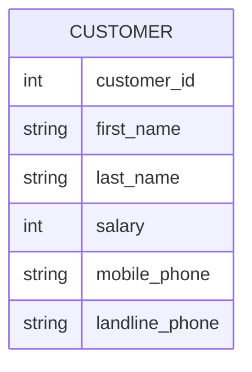
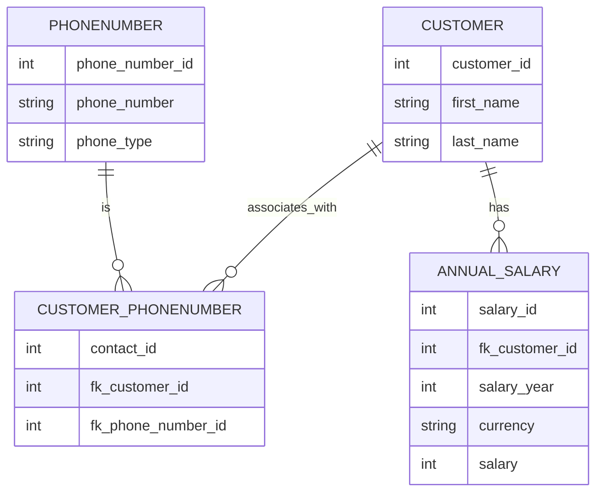

## Transaktiokannat

### SQL synty

Tietokantojen normalisointiprosessin keksi IBM:n tutkija E.F. ”Ted” Codd 1970-luvun alussa, minkä voi nähdä jossain määrin nykymuotoisten tietokantojen syntyhetkenä. Relaatiotietokantamallin peruskäsitteitä ovat relaatiot (eli taulut) ja niiden väliset yhteydet (eng. relationships). Codd havaitsi, että normalisoimattomat taulut johtavat helposti ongelmiin, joita hän kutsui anomalioiksi. Näiden vaikutus on, että tietoa voi olla mahdotonta lisätä, muokata tai poistaa siten, että operaatio rajautuisi vain yhden entiteetin tietoihin. Tietojen esittämiseen ja käsittelyyn sovelletaan joukko-oppiin perustuvaa relaatiotietokantateoriaa.

!!! tip "Tietokantateorian sanastoa"

    **Relaatiotietokanta** = Relaatiomalliin perustuvan tietokannan hallintajärjestelmän avulla toteutettu tietokanta<br />
    **Relaatio, taulu** = Rakenteeltaan samanlaisten monikoiden joukko. (relation, table)<br />
    **Yhteys** = kahden taulun välinen suhde (eng. relationship)<br />
    **Rivi, monikko** = Vaakasuuntainen rivi taulussa (eng. row, tuple)<br />
    **Sarake, ominaisuus, määrite** = Pystysuuntainen sarake taulussa (eng. column)<br />
    **Alkio, solu** = Taulun solu (eng. cell, item)<br />
    **Arvo** = Taulun solun sisältö (eng. value)
    
    Lähde: [Relaatiotietokantasanasto, Harri Laine, Helsingin Yliopisto](https://www.cs.helsinki.fi/u/laine/relaatiosanasto/)

Huomaa, että yllä esitelty monikko on englanniksi tuple. Pythonia osaaville tämä on entuudestaan tuttu sekvenssitietotyyppi. Relaatiotietokannan taulu voidaan siis nähdä listana monikkoja: ja näin database-connectorin cursor sen usein palauttaakin.

```python
taulu: list[tuple[int, str, int]] = [
    (1, "Rose", 167),
    (2, "Lisa", 182),
    (3, "Jack", 180),
]
```

### Kuin Excel?

Tietokannoista tai tauluista puhuttaessa tulee herkästi mieleen Excel tai Google Spreadsheet. Taulukkolaskentaohjelman tauluun on toki mahdollista käsin kirjata hyväkin tietokantamalli, mutta kukaan ei myöskään estä tilannetta, jossa tietomalli on tietokoneen näkökulmasta kaoottinen. Alla esimerkki taulusta, joka voi olla jollekin ihmisyksilölle täysin järkeenkäypä, mutta ei koneluettava.

| Name        | Salary      | GSM                    | Phone                |
| ----------- | ----------- | ---------------------- | -------------------- |
| Jack Bauer  | $100 k      | +358441234123          | 112 ja sit 911       |
| Bond, James | 30*10^6     | 040 1234 777           | 08 111 2222          |
| James Bond  | 30e6        | 007                    | <= Käyttää vain tota |
| Lisa        | 100,000.0 £ | N/A                    | 09 222 4444          |
| -- "" --    | -- "" --    | Toi on mökin numero => | 05 333 7777          |

Jotta tieto on järjestettävissä millään tavoin normalisoiduksi, pitää kunkin rivin taulussa noudattaa yhtä, selkeää skeemaa. Mikäli lähdedata olisi alla olevan skeeman mukaista, olisi sitä jo jossain määrin mahdollista alkaan normalisoida pidemmälle.



### Normalisointi

Aiemmin mainitun takia tietokannan taulut normalisoidaan eli hajautetaan useisiin tauluihin ja taulujen välisiä suhteita kuvataan avaimilla ja viiteavaimilla. Yksittäisen entiteetin tai taulun sarakkeet eivät sisällä riippuvuuksia toisiinsa; tiedolla on suora riippuvuus vain ja ainoastaan taulun primääriavaimeen, joka on useimmiten keinotekoinen, juokseva kokonaisluku. Mikäli käyttäjä haluaa tulostaa esimerkiksi ostotapahtumasta kuitin, tietoa pitää hakea ja yhdistää useista eri tauluista, kuten: `invoice`, `invoice_line_item`, `product`, `customer`.


#### Normaalimuodot

Codd jakoi tietokantojen normalisoinnin asteet järjestysluvuilla eri muotoihin, jotka ovat ensimmäinen, toinen ja kolmas normaalimuoto. Näistä käytetään lyhenteitä: ==1NF, 2NF ja 3NF==. Muissa teoksissa tai lähteissä saattaa törmätä myös 0NF, 4NF, 5NF tai BCNF -lyhenteisiin.

Näiden vaatimukset ovat lyhyesti:

* 1NF : Taulun jokainen sarake sisältää vain yhden arvon
* 2NF : Taulun jokainen sarake on suoraan riippuvainen primääriavaimesta
* 3NF : Taulun jokainen sarake on suoraan riippuvainen primääriavaimesta, eikä muiden sarakkeiden kautta

#### Esimerkki: Puhelinnumerot

Käytännössä tämä ajaa siihen, että useimmat normalisoidun tietokannan taulut edustavat joitain entiteettejä. Yksi taulu voi olla customer, toinen phone numbers, ja niin edelleen. Tietokantajärjestelmä ylläpitää näiden taulujen välisiä suhteita. Alla esimerkki normalisoidusta tietokannasta, jossa on kolmen entiteetit taulut: `CUSTOMER`, `PHONENUMBER` ja `ANNUAL_SALARY`. Lisäksi on taulu `CUSTOMER_PHONENUMBER`, joka yhdistää asiakkaat ja heidän puhelinnumeronsa. Tämä on tarpeellinen many-to-many -suhteiden mallintamiseksi. Sama puhelinnumero, varsinkin landline, voi olla useammalla asiakkaalla. Toisaalta asiakkaalla voi olla useampi puhelinnumero.



Lopulta alkuperäisen kaltaisen, yhden ison taulun presentaation, saa muodostettua liittämällä taulut yhteen primääri- ja viiteavaimia käyttäen. Tämä vaihe tunnetaan nimellä ==denormalization==. Huomaa, että taulujen liittäminen (eng. joining) on I/O:n näkökulmasta kallis operaatio. Operatiiviset kannoissa normalisointi estää tiedon päivittämisestä tai poistamisesta syntyviä anomalioita, mutta analytiikkaan käytettävissä kannoissa, jotka esitellään hieman alempana, on usein hyödyllistä mallintaa tieto hieman vähemmän normalisoituun muotoon. Äärimmäinen normaliuden purkamisen muoto on One Big Table; hieman yleisempi on analytiikan tarpeisiin suunniteltu tähtiskeema.

SQL on tietovarastoissa yleinen kieli, joten liitetään normalisoidut taulut yhdeksi suurekti tauluksi SQL:ää hyödyntäen esimerkin vuoksi. Alla on adminitionin alla esimerkkidataa, joka noudattaa yllä määriteltyjen taulujen dataa:

=== "Customer"

    | customer_id | first_name | last_name |
    | ----------: | :--------- | :-------- |
    |           1 | John       | Doe       |
    |           2 | Jane       | Smith     |
    |           3 | Alice      | Johnson   |

=== "Annual salary"

    | salary_id | fk_customer_id | salary_year | currency | salary |
    | --------: | -------------: | ----------: | :------- | -----: |
    |         1 |              1 |        2023 | USD      |  60000 |
    |         2 |              2 |        2023 | USD      |  55000 |
    |         3 |              3 |        2023 | USD      |  70000 |
    
=== "Phone number"

    | phone_number_id | phone_number | phone_type |
    | --------------: | :----------- | :--------- |
    |               1 | 040 6548 471 | gsm        |
    |               2 | 08 618 9910  | landline   |

=== "Customer-Phonenumber"

    | contact_id | fk_customer_id | fk_phone_number_id |
    | ---------: | -------------: | -----------------: |
    |          1 |              1 |                  1 |
    |          2 |              2 |                  2 |
    |          3 |              3 |                  1 |
    |          4 |              3 |                  2 |

    !!! info

        Lukuohje:

            * John Doe (1) has GSM.
            * Jane Smith (2) has Landline. 
            * Alice Johnson (3) has both GSM and Landline.

Datat voidaan joinata seuraavalla queryllä:

??? info "Klikkaa query esiin"

    ```sql
    SELECT
        CONCAT(c.first_name, ' ', c.last_name) AS full_name,
        ann.salary,
        ann.currency,
        pn.phone_type,
        pn.phone_number
    FROM customer c
    LEFT JOIN annual_salary ann ON c.customer_id = ann.fk_customer_id
    LEFT JOIN customer_phonenumber AS mm ON c.customer_id = mm.fk_customer_id
    LEFT JOIN phonenumber pn ON mm.fk_phone_number_id = pn.phone_number_id;
    ```

Yhdistynyt data näyttää seuraavalta:

|      | full_name     | salary | currency | phone_type | phone_number |
| ---: | :------------ | -----: | :------- | :--------- | :----------- |
|    0 | John Doe      |  60000 | USD      | gsm        | 040 6548 471 |
|    1 | Jane Smith    |  55000 | USD      | landline   | 08 618 9910  |
|    2 | Alice Johnson |  70000 | USD      | landline   | 08 618 9910  |
|    3 | Alice Johnson |  70000 | USD      | gsm        | 040 6548 471 |


!!! question "Tehtävä"

    Pohdi, kuinka esittäisit palkan vertailukelpoisena eri valuutoissa. Taulussa on valuuttakoodi, mutta se ei ole sinällään vertailukelpoinen. Taulussa on myös vuosiluku. Miten ratkaisisit tämän ongelman?

!!! question "Tehtävä"

    Merkkijonokenttä "phone_type" on yhä normalisoimatta. Kuinka ratkaisisit tämän ongelman?


## Tietovarastot

Käyttöjärjestelmien ja ohjelmointikielien runsaus sekä standardien puute muodostivat kaaoksen 1960-luvua edeltävänä aikana. Vuosikymmen 1960 oli IBM 360 -suurtietokoneiden ja saman yrityksen tietokannan hallintajärjestelmän, IMS:n, valtaaikaa. Tällöin, kauan sitten, eli ennen 1980- ja 1990-lukujen vaihdetta, ==samoja kantoja käytettiin sekä operatiiviseen käyttöön että datan analysointiin==. Nämä transaktiokannat mahdollistivat yrityksille nykypäivänä itsestäänselviä prosesseja, kuten käteisnoston pankkiautomaatilla tai lennon varauksen, mutta niitä käytettiin myös analyyttisiin kyselyihin. Mikäli yrityksen johtoa kiinnosti kokonaismyynti tammikuussa, data haettiin samasta tuotantokannasta, mihin se oli kirjoitettukin. Kyselykieli oli sekä OLTP- että OLAP-kyselyissä yleisimmin SQL.

### Datan määrän kasvu

Datan määrän sekä analytiikan tarpeen kasvaessa yritykset alkoivat  integroida tuotantojärjestelmien dataa keskitettyyn varastoon, joka ==on optimoitu OLAP-käyttöä varten==. Näistä järjestelmistä käytetään nimeä **tietovarasto** (eng. data warehouse). Tietovarasto  sisältää siis yhden tai useamman tuotantokannan dataa. 1990-luvulla IBM:n haastaja  eli Teradata-yhtiö mahdollisti MPP:n (eng. massively parallel processing) eli massiivisen rinnakkaislaskennan. 2000 luvun puolella kuvioihin astui hajautettuun tallennukseen ja laskentaan perustuva Apache Hadoop, jonka reppuselässä IBM, Cloudera, Hortonworks ja muut ratsastivat. Hadoop itsessään talsii Googlen GFS:n (Google File Systemin) jalanjäljissä.

!!! tip "Sanastoa"

    * **OLTP** = Transaktioihin liittyvät kyselyt (Online Transaction Processing)
    * **OLAP** = Analytiikkaan liittyvät kyselyt (Online Analytical Processing)
    * **HTAP** = Arkkitehtuuri, jossa käytetään yhtä tietokantaa sekä transaktioihin että analytiikkaan (Hybrid Transactional/Analytical Processing)
  
    Huomaa, että HTAP on ainakin toistaiseksi enemmän teoriaa kuin käytäntöä. Jos haluat tutustua aiheeseen, lue esimerkiksi TiDB:n postaus [The Beauty of HTAP: Defining a Modern Data Architecture with TiDB](https://www.pingcap.com/blog/htap-demystified-defining-modern-data-architecture-tidb/). Lähtökohtaisesti tällä kurssilla kuitenkin oletetaan, että OLTP:tä varten on yksi kantaratkaisu ja OLAP:ia varten toinen.

!!! question "Tehtävä"

    Kannattaa vähintäänkin silmäillä papereita, jotka alunperin herättivät Apache Nutch -kehittäjien kiinnostuksen, ja siten antoivat sysäyksen Hadoopin kehitykselle:

    * [Google File System](https://static.googleusercontent.com/media/research.google.com/fi//archive/gfs-sosp2003.pdf)
    * [MapReduce: Simplified Data Processing on Large Clusters](https://static.googleusercontent.com/media/research.google.com/fi//archive/mapreduce-osdi04.pdf)

### Tietokanta ja -varasto rinnakkain

On tärkeää ymmärtää, että tietovarasto sisältää ==kopion useiden lähdejärjelmien datasta==. Tietovarasto ei ole siis vaihtoehto operatiiviselle kannalle. Se on tekninen ratkaisu, joka mahdollistaa analyyttiset kyselyt, jotka olisivat liian raskaita operatiiviselle kannalle - mutta se ei suinkaan korvaa perinteistä tietokantaa OLTP-käyttötapauksissa.

!!! tip

    Yllä mainitut HTAP-järjestelmät ovat lupaus tulevaisuudesta, jossa nämä muodostavat jonkin sortin keskitetyn monitoimikoneen, joka pystyy suorittamaan sekä transaktioita että analytiikkaa. Tämä ei kuitenkaan tarkoita, että nämä olisivat myöskään "zero copy", vaan konepellin alla voidaan hyvinkin säilöä data rivi- tai saraketasolla duplikaatteina.

## Tietolammet

### Data Lake

**Tietolampi** (engl. data lake) syntyi Hadoop-ekosysteemin myötä. Tietolampi on suuri, hajautettu tiedostojärjestelmä, johon dataa voidaan tallentaa raakamuodossa. Tietolampi on tarkoitettu suurten datamäärien tallentamiseen ja analysointiin. Tietolammen riskinä on, että yhteen laariin kaadettu skeematon data muodostaa ns. **datasuon** (engl. data swamp). Dataa siis on terakaupalla, mutta kukaan ei tiedä, missä se lienee.

Tietolampi on kenties helpoin selittää koodin avulla. Kuvitellaan koodi, jossa hajautettu laskentamoottori Apache Spark lataa dataa Amazon S3:sta, käsittelee sitä ja tallentaa tuloksen takaisin S3:een Parquet-formaatissa. Tässä tapauksessa Amazon S3 on siis tietolampi; Apache Spark on laskentamoottori, joka käsittelee dataa; ja Parquet on tallennusformaatti, joka on optimoitu analytiikkaa varten.

Alla oleva koodi tekee seuraavat vaiheet:

* Lataa kaikki .png-tiedostot Amazon S3:sta
* Käsittelee kuvat ja laskee niistä feature-vektorin koneoppimismallin syötettä varten
* Tallentaa sekä kuvadatan että vektorit takaisin järveen (mutta eri lokaatioon) 

```python
# Path to the dataset
dataset_path = "s3://bucket-name/path/to/2024/10/31/*.png"

# Read PNG files from the given path
df = spark.read.format("binaryFile").option("pathGlobFilter", "*.png").load(dataset_path)

# The df will contain columns:
# * path: StringType
# * modificationTime: TimestampType
# * length: LongType
# * content: BinaryType

def derive_feature_vector(content):
    # Process the content and return a feature vector
    return [1.0, 2.0, 3.0]

udf_feat_desc = F.udf(derive_feature_vector, ArrayType(DoubleType()))

# Add a new column with a feature vector
df_feat = df.withColumn("feature_vector", udf_feat_desc(df.content))

# Write the DataFrame to Parquet format
output_path = "s3://bucket-name/output/feature-vector-table/2024-10-31-table.parquet"
df_with_features.write.mode("append").parquet(output_path)
```

Jokin myöhempi koodinpätkä voisi sitten ladata tämän Parquet-tiedoston ja käyttää sitä koneoppimismallin opettamiseen. Esimerkiksi näin:

```python
# Lataa kaikkien päivien feature-vektorit
df = spark.read.parquet("s3://bucket-name/output/feature-vector-table/")

# Käytä feature-vektoreita koneoppimismallin opettamiseen
model = SomeMLModel().fit(df)
```

Yllä oleva esimerkki on luonnollisesti yksinkertaistettu rankasti, mutta toivon mukaan se demonstroi datajärven olemusta: ==datajärvi on vain tallennuspaikka==, johon voi dumpata mitä tahansa dataa, ja kyseisen datan voi ladata jollakin laskenta- tai analytiikkatyökalulla. Datajärvi **ei siis ole** jokin tietty RDBMS. Ei ole tietokantaa. Ei ole koko tietokantaserveriä. On vain dataa järvessä.

## Modern Data Stack

Yllä olevasta materiaalista on jo toivon mukaan selvinnyt, että työkaluja voi olla useita rinnakkain - esimerkiksi: operatiivinen tietokanta (tai monta), tietovarasto, tietojärvi ja jokin laskentaklusteri, jolla jälkimmäistä käsitellään. Jos tähän liitetään vielä työkaluja, joilla dataa tuodaan ja viedään, sekä työkaluja, joilla dataa visualisoidaan, niin kokonaisuudesta voidaan käyttää sanaa **data-alusta** (eng. data platform). Data-alusta voi olla valtava, keskitetty yksi työkalu, tai se voi olla hajautettu, pienistä modulaarisista palasista koostuva kokonaisuus. Jälkimmäiseen viitataan usein termillä **moderni data stack**.

Fishtown Analyticsin [Tristan Handy tiivistää](https://www.getdbt.com/blog/future-of-the-modern-data-stack/) modernin tietoinfran  (eng. modern data stack) nykyisen vaiheen alkaneen vuonna 2012 Amazon Redshiftin myötä. Hän listaa kolme vaihetta, jotka ovat leikkisästi nimetyt: 

* ensimmäisen kambrikauden räjähdys 2012–2016
* käyttöönottokausi 2016–2020
* ja hänen ennustelmiensa mukaan toinen kambrikauden räjähdys 2020–2025
 
Tristan ei mainitse Hadoopia sanallakaan kirjoituksessaan, mutta mainitsee Snowflaken sekä Google BigQueryn sekä useita muita tietoinfraan liittyviä tuotteita kuten Looker, Fivetran, Stitch, Redash ja heidän oma tuotteensa eli dbt.

!!! question "Tehtävä"

    Lue Tristan Handyn tuoreempi kirjoitus helmikuulta 2024, [Is the "Modern Data Stack" Still a Useful Idea?](https://roundup.getdbt.com/p/is-the-modern-data-stack-still-a). Miten hän vastaa otsikon kysymykseen?

Oli termi *modern data stack* nykyisin pelkkä meemi tai ei, sen aikakauden dataratkaisut jättivät muutoksia jälkeensä. Näitä muutoksia, verrattuna *legacy-aikoihin*, ovat muiden muassa:

* **ETL vs. ELT**: Perinteisesti data on siirretty ETL:n (Extract, Transform, Load) avulla. Moderneissa järjestelmissä data alettiin tuoda tietovaraston stagingiin `as-raw-as-possible`-hengessä, ja muokkaus (Transform) laskettiin tietovarastossa eikä ingestion toolilla.
* **On-Prem vs. Pilvi**: Useat tällä kurssilla mainituista teknologioista toimivat lähtökohtaisesti pilvessä. Osa on myös hybrid/on-prem.
* **Monoliitti vs. Best-of-breed**: Perinteisesti tietovarasto on ollut monoliittinen, mutta modernissa ekosysteemissä on useita eri työkaluja, jotka on integroitu toisiinsa.
* **Eritetty laskenta ja tallennus**: Perinteisesti tietovarastossa tallennus ja sen laskenta ovat olleet saman instanssin sisällä. Jos skaalaat instanssia suuremmaksi, hinta nousee sekä tallenuskapasiteetin että laskentehon mukaan, vaikka olisit tarvinnut vain. Modernissa ekosysteemissä laskenta on irrotettu (eng. decoupled) tallennuksesta. Laskenta tapahtuu esimerkiksi Apache Sparkilla, tallennus esimerkiksi Amazon S3:een. Näitä voidaan skaalata erikseen.
* **Indeksointi**: Usein tietovarastot ovat indeksoimattomia. Tietovarasto tiedä taulujen välisistä linkeistä (primary keys, foreign keys) mitään. Hakuja optimoidaan toisella tavoin.


### Data Lakehouse

Kuten yllä on mainittu, Hadoop yhdistetään usein termiin tietoallas eli data lake, joka on pahimmillaan yrityksen jaettua levyä muistuttava datan hautausmaa tai "data swamp". Handy määrittelee modernin siten, että moderni datan aikakausi alkoi Hadoopin ja perinteisten tietoaltaiden kuoppauksesta. Ekosysteemiin on sittemmin liittynyt melkoinen määrä erilaisia työkaluja ja uudenlaisia paradigmoja. Snowflaken yksi merkittävä kilpailija on Databricks, jonka tuotteen sydämenä toimii heidän aloittamansa Apache Spark. Sekä Snowflake että Hadoop, kuten myös monet muut toimijat, eriyttivät laskennan ja tallennuksen. Tallennustilana toimii tietoallas, tavallaan, mutta mieluiten siten, että datan skeema ja sijainti ylläpidetään katalogissa. 

Nykyään tästä hybridistä käytetään termiä Data Lakehouse (Data **Lake** + Data Ware**house**), ja sen pyrkimyksenä on yhdistää näiden parhaat puolet. Nämä "parhaat puolet" tiivistyvät usein lyhenteeseen ACID, joka on ikään kuin laatukriteeristö tai määritelmä tietokantaoperaatioille, jotka tyypillisesti ovat relaatiotietokantahallintajärjestelmän (RDBMS) heiniä. Ideaalitilanteessa Lakehouse käyttäytyy kuin Warehouse, mutta data on tallennettuna edulliseen Lakeen. Tällöin "warehouse" on esimerkiksi Apache Hive, ja "lake" on esimerkiksi Amazon S3. ACID käsitellään myöhemmin [Storage](../kerrokset/storage.md)- eli tallennuskerroksen yhteydessä. Toisin kuin tyypillinen warehouse, lakehouse mahdollistaa kuitenkin minkä tahansa tiedon tallentamisen altaaseen (kuvat, videot, raaka sensoridata, ...)


### Landscape ja Moderni tänään

Modern data stack on siitä hassu sanavalinta, että "modern" on kohtalaisen suhteellinen käsite - aivan samalla tavalla kuin big datan "big". Aika näyttää, jäävätkö kummatkin termit elämään, jolloin joka vuosi sekä modernius että suuruus määrittyvät uusiksi. Oli termi mikä tahansa, data landscape pitänee katsastaa joka vuosi hieman uusin silmin, sillä muutos ja kasvu on ollut 2000-luvulla nopeaa. Termit ja trendit tulevat ja menevät, mutta tarve datan käsittelyyn, analytiikkaan ja liiketoiminnan ongelmien ratkaisemiseen pysyy.

On syntynyt myös liikehdintää suuntaan, jossa pienemmille toimijoille tarjotaan ei-niin-big-datan työkaluja, kuten DuckDB, jota kaupallistaa MotherDuck. SaaS-työkalujen luomalle hajautukselle on syntynyt myös vastarintaa, jossa *unification* on tavoitteena. Esimerkiksi Microsoft Fabric pyrkii olemaan yksi työkalu, joka pyrkii yhdistämään koko data stackin yhden nimikkeen alle.


**Kuvio 1:** *Ekosysteemien muutos vuosista 2012 alkaen. Työkalujen määrä on kasvanut reippaalla tahdilla.* (Lähde: [Matt Turck](https://mattturck.com/))

!!! question "Tehtävä"

	Kuvassa näkyvä 2023 arkkitehtuuri löytyy interaktiivisena versiona täältä: [FirstMark | 2023 MAD (ML/AI/Data) Landscape](https://mad.firstmark.com/). Tutustu otsikkotasolla graafiin. Mitä eri kategorioita kokonaisuuteen kuuluu?

!!! tip

    Useat muutkin yritykset toimivat kuten MotherDuck eli kaupallistavat avointa lähdekoodia. Näihin lukeutuvat muiden muassa Databricks (Spark), Nginx, MongoDB, Confluent (Kafka), HashiCorp (Terraform), Red Hat (RHEL, CentOS). Bisnesmallin pohjalla oleva päätuote on open source, mutta sitä kaupallistetaan yritysasiakkaille managed SaaS-palveluna. Tämän voi nähdä datan käytön demokratisointina: yrityksellä ei tarvitse olla varaa Clouderan, Oraclen, IBM:n tai muiden jättien lisensseihin käsitelläkseen dataa.


## Historia videona

<iframe width="560" height="315" src="https://www.youtube.com/embed/-wCzn9gKoUk?si=EVkxdjh_6WnDZiPn" title="YouTube video player" frameborder="0" allow="accelerometer; autoplay; clipboard-write; encrypted-media; gyroscope; picture-in-picture; web-share" referrerpolicy="strict-origin-when-cross-origin" allowfullscreen></iframe>

**Video 1:** *Hannes Mühleisen, joka on DuckDB:n perustajajäsen ja MotherDuckin toimitusjohtaja, kertoo tietokantojen historiasta. Huomaa, että varsinkin videon lopun osalta Hannesilla on oma agenda.*