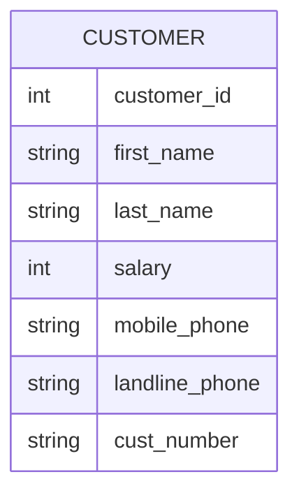
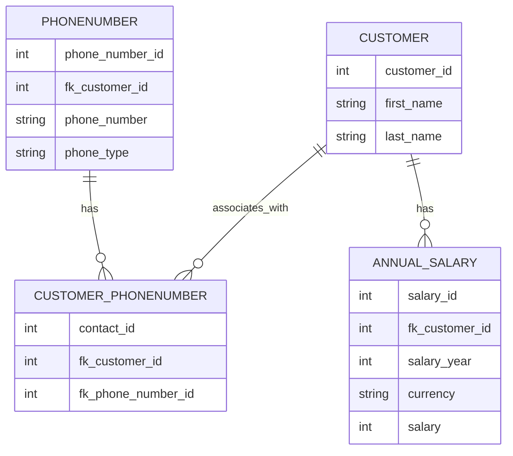

Tietokantojen normalisointiprosessin keksi IBM:n tutkija E.F. ”Ted” Codd 1970-luvun alussa, minkä voi nähdä jossain määrin nykymuotoisten tietokantojen syntyhetkenä. Relaatiotietokantamallin peruskäsitteitä ovat relaatiot (eli taulut) ja niiden väliset yhteydet (eng. relationships). Codd havaitsi, että normalisoimattomat taulut johtavat helposti ongelmiin, joita hän kutsui anomalioiksi. Näiden vaikutus on, että tietoa voi olla mahdotonta lisätä, muokata tai poistaa siten, että operaatio rajautuisi vain yhden entiteetin tietoihin. Tietojen esittämiseen ja käsittelyyn sovelletaan joukko-oppiin perustuvaa relaatiotietokantateoriaa.

!!! tip "Tietokantateorian sanastoa"

    **Relaatiotietokanta** = Relaatiomalliin perustuvan tietokannan hallintajärjestelmän avulla toteutettu tietokanta<br />
    **Relaatio, taulu** = Rakenteeltaan samanlaisten monikoiden joukko. (relation, table)<br />
    **Yhteys** = kahden taulun välinen suhde (eng. relationship)<br />
    **Rivi, monikko** = Vaakasuuntainen rivi taulussa (eng. row, tuple)<br />
    **Sarake, ominaisuus, määrite** = Pystysuuntainen sarake taulussa (eng. column)<br />
    **Alkio, solu** = Taulun solu (eng. cell, item)<br />
    **Arvo** = Taulun solun sisältö (eng. value)
    
    Lähde: [Relaatiotietokantasanasto, Harri Laine, Helsingin Yliopisto](https://www.cs.helsinki.fi/u/laine/relaatiosanasto/)

Huomaa, että yllä esitelty monikko on englanniksi tuple. Pythonia osaaville tämä on entuudestaan tuttu sekvenssitietotyyppi. Relaatiotietokannan taulu voidaan sii nähdä listana monikkoja: ja näin database-connectorin cursor sen usein palauttaakin.

```python
# Schema: (id: int, name: str, height: int)
taulu = [
    (1, "Rose", 167),
    (2, "Lisa", 182),
    (3, "Jack", 180),
]
```

## Normalisointi

Aiemmin mainitun takia tietokannan taulut normalisoidaan eli hajautetaan useisiin tauluihin ja taulujen välisiä suhteita kuvataan avaimilla ja viiteavaimilla. Yksittäisen entiteetin tai taulun sarakkeet eivät sisällä riippuvuuksia toisiinsa; tiedolla on suora riippuvuus vain ja ainoastaan taulun primääriavaimeen, joka on useimmiten keinotekoinen, juokseva kokonaisluku. Mikäli käyttäjä haluaa tulostaa esimerkiksi ostotapahtumasta kuitin, tietoa pitää hakea ja yhdistää useista eri tauluista, kuten: `invoice`, `invoice_line_item`, `product`, `customer`.

### Excel

Tietokannoista tai tauluista puhuttaessa tulee herkästi mieleen Excel tai Google Spreadsheet. Taulukkolaskentaohjelman tauluun on toki mahdollista käsin kirjata hyväkin tietokantamalli, mutta kukaan ei myöskään estä tilannetta, jossa tietomalli on tietokoneen näkökulmasta kaoottinen. Alla esimerkki taulusta, joka voi olla jollekin ihmisyksilölle täysin järkeenkäypä, mutta ei koneluettava.

| Name        | Salary      | GSM                    | Phone                |
| ----------- | ----------- | ---------------------- | -------------------- |
| Jack Bauer  | $100 k      | +358441234123          | 112 ja sit 911       |
| Bond, James | 30*10^6     | 040 1234 777           | 08 111 2222          |
| James Bond  | 30e6        | 007                    | <= Käyttää vain tota |
| Lisa        | 100,000.0 £ | N/A                    | 09 222 4444          |
| -- "" --    | -- "" --    | Toi on mökin numero => | 05 333 7777          |

Jotta tieto on järjestettävissä millän tavoin normalisoiduksi, pitää kunkin rivin taulussa noudattaa yhtä, selkeää skeemaa. Mikäli lähdedata olisi alla olevan skeeman mukaista, olisi sitä jo jossain määrin mahdollista alkaan normalisoida pidemmälle.



### Normaalimuodot

Codd jakoi tietokantojen normalisoinnin asteet järjestysluvuilla eri muotoihin, jotka ovat ensimmäinen, toinen ja kolmas normaalimuoto. Näistä käytetään lyhenteitä: ==1NF, 2NF ja 3NF==.

Näiden vaatimukset ovat lyhyesti:

* 1NF : Taulun jokainen sarake sisältää vain yhden arvon
* 2NF : Taulun jokainen sarake on suoraan riippuvainen primääriavaimesta
* 3NF : Taulun jokainen sarake on suoraan riippuvainen primääriavaimesta, eikä muiden sarakkeiden kautta

Käytännössä tämä ajaa siihen, että useimmat normalisoidun tietokannan taulut edustavat joitain entiteettejä. Yksi taulu voi olla customer, toinen phone numbers, ja niin edelleen. Tietokantajärjestelmä ylläpitää näiden taulujen välisiä suhteita. Alla esimerkki normalisoidusta tietokannasta, jossa on kolmen entiteetit taulut: `customer`, `phone_number` ja `annual_salary`. Lisäksi on taulu `customer_phone_number`, joka yhdistää asiakkaat ja heidän puhelinnumeronsa. Tämä on tarpeellinen many-to-many -suhteiden mallintamiseksi. Sama puhelinnumero, varsinkin landline, voi olla useammalla asiakkaalla. Toisaalta asiakkaalla voi olla useampi puhelinnumero.



Lopulta yhden taulun presentaation saa muodostettua SQL:n avulla, pseudo-SQL-koodina näin:

```sql
SELECT
  CONCAT(a.first_name, " ", a.last_name) AS full_name,
  salary,
  currency,
  gsm.phone_number AS gsm_nr,
  landline.phone_number AS landline_nr
FROM
  customer a
  LEFT JOIN annual_salary s ON a.customer_id = s.fk_customer_id
    LEFT JOIN phonenumber AS gsm ON a.customer_id = gsm.fk_customer_id 
      AND gsm.phone_type = "gsm"
    LEFT JOIN PHONENUMBER AS landline ON a.customer_id = landline.fk_customer_id 
      AND landline.phone_type = "landline"
```

!!! question "Tehtävä"

    Pohdi, kuinka esittäisit palkan vertailukelpoisena eri valuutoissa. Taulussa on valuuttakoodi, mutta se ei ole sinällään vertailukelpoinen. Taulussa on myös vuosiluku. Miten ratkaisisit tämän ongelman?


### Relaatiotietokannoista tietovarastoihin

Käyttöjärjestelmien ja ohjelmointikielien runsaus sekä standardien puute muodostivat kaaoksen 1960-luvua edeltävänä aikana. Vuosikymmen 1960 oli IBM 360 -suurtietokoneiden ja saman yrityksen tietokannan hallintajärjestelmän, IMS:n, valtaaikaa. Tällöin, kauan sitten, eli ennen 1980- ja 1990-lukujen vaihdetta, samoja kantoja käytettiin sekä operatiiviseen käyttöön että datan analysointiin. Nämä transaktiokannat mahdollistivat yrityksille nykypäivänä itsestäänselviä prosesseja, kuten käteisnoston pankkiautomaatilla tai lennon varauksen, mutta niitä käytettiin ==myös analyyttisiin kyselyihin==. Mikäli yrityksen johtoa kiinnosti kokonaismyynti tammikuussa, data haettiin samasta tuotantokannasta, mihin se oli kirjoitettukin. Kyselykieli oli sekä OLTP- että OLAP-kyselyissä yleisimmin SQL.

!!! tip "Sanastoa"

    **OLTP** = Transaktioihin liittyvät kyselyt (Online Transaction Processing)<br />
    **OLAP** = Analytiikkaan liittyvät kyselyt (Online Analytical Processing)

Datan määrän sekä analytiikan tarpeen kasvaessa yritykset alkoivat  integroida tuotantojärjestelmien dataa keskitettyyn varastoon, joka ==on optimoitu OLAP-käyttöä varten==. Näistä järjestelmistä käytetään nimeä tietovarasto (eng. data warehouse). Tietovarasto  sisältää siis yhden tai useamman tuotantokannan dataa. 1990-luvulla IBM:n haastaja  eli Teradata-yhtiö mahdollisti MPP:n (eng. massively parallel processing) eli massiivisen rinnakkaislaskennan. 2000 luvun puolella kuvioihin astui hajautettuun tallennukseen ja laskentaan perustuva Apache Hadoop, jonka reppuselässä IBM, Cloudera, Hortonworks ja muut ratsastivat. Hadoop itsessään talsii Googlen GFS:n (Google File Systemin) jalanjäljissä.

!!! question "Tehtävä"

    Kannattaa vähintäänkin silmäillä papereita, jotka alunperin herättivät Apache Nutch -kehittäjien kiinnostuksen, ja siten antoivat sysäyksen Hadoopin kehitykselle:

    * [Google File System](https://static.googleusercontent.com/media/research.google.com/fi//archive/gfs-sosp2003.pdf)
    * [MapReduce: Simplified Data Processing on Large Clusters](https://static.googleusercontent.com/media/research.google.com/fi//archive/mapreduce-osdi04.pdf)
  

## Modern Data Stack

Fishtown Analyticsin [Tristan Handy tiivistää](https://www.getdbt.com/blog/future-of-the-modern-data-stack/) modernin tietoinfran  (eng. modern data stack) nykyisen vaiheen alkaneen vuonna 2012 Amazon Redshiftin myötä. Hän listaa kolme vaihetta, jotka ovat leikkisästi nimetyt ensimmäisen kambrikauden räjähdys 2012–2016, käyttöönottokausi 2016–2020, ja hänen ennustelmiensa mukaan toinen kambrikauden räjähdys 2020–2025. Tristan ei mainitse Hadoopia sanallakaan kirjoituksessaan, mutta mainitsee Snowflaken sekä Google BigQueryn sekä useita muita tietoinfraan liittyviä tuotteita kuten Looker, Fivetran, Stitch, Redash ja heidän oma tuotteensa eli dbt.

Joitakin eroja legacyn ja modernin välillä:

* ETL vs. ELT : Perinteisesti data on siirretty ETL:n (Extract, Transform, Load) avulla. Moderneissa järjestelmissä data alettiin tuoda tietovaraston stagingiin `as-raw-as-possible`-hengessä, ja muokkaus (Transform) laskettiin tietovarastossa eikä ingestion toolilla.
* Monoliitti vs. Best-of-breed : Perinteisesti tietovarasto on ollut monoliittinen, mutta modernissa ekosysteemissä on useita eri työkaluja, jotka on integroitu toisiinsa.
* Laskenta keskitettyä vs. irrotettu tallennuksesta : Perinteisesti tietovarastossa on ollut sekä data että laskenta. Modernissa ekosysteemissä laskenta on irrotettu tallennuksesta, ja laskenta tapahtuu esimerkiksi Apache Sparkilla tai Snowflaken omalla laskentapalvelulla.

### Lake

Hadoop yhdistetään usein termiin tietoallas eli data lake, joka on pahimmillaan yrityksen jaettua levyä muistuttava datan hautausmaa tai "data swamp". Handy määrittelee modernin siten, että moderni datan aikakausi alkoi Hadoopin ja perinteisten tietoaltaiden kuoppauksesta. Ekosysteemiin on sittemmin liittynyt melkoinen määrä erilaisia työkaluja ja uudenlaisia paradigmoja. Snowflaken yksi merkittävä kilpailija on Databricks, jonka tuotteen sydämenä toimii heidän aloittamansa Apache Spark. Sekä Snowflake että Hadoop, kuten myös monet muut toimijat, eriyttivät laskennan ja tallennuksen. Tallennustilana toimii tietoallas, tavallaan, mutta mieluiten siten, että datan skeema ja sijainti ylläpidetään katalogissa. Nykyään tästä hybridistä käytetään termiä Data Lakehouse (Data **Lake** + Data Ware**house**), ja sen pyrkimyksenä on yhdistää näiden parhaat puolet. Nämä "parhaat puolet" tiivistyvät usein lyhenteeseen ACID, joka on ikään kuin laatukriteeristö tai määritelmä tietokantaoperaatioille, jotka tyypillisesti ovat relaatiotietokantahallintajärjestelmän (RDBMS) heiniä. Ideaalitilanteessa Lakehouse käyttäytyy kuin Warehouse, mutta data on tallennettuna edulliseen Lakeen. Tällöin "warehouse" on esimerkiksi Apache Hive, ja "lake" on esimerkiksi Amazon S3. ACID käsitellään myöhemmin [Storage](../kerrokset/storage.md)- eli tallennuskerroksen yhteydessä. Toisin kuin tyypillinen warehouse, lakehouse mahdollistaa kuitenkin minkä tahansa tiedon tallentamisen altaaseen (kuvat, videot, raaka sensoridata, ...)

On syntynyt myös liikehdintää suuntaan, jossa pienemmille toimijoille tarjotaan ei-niin-big-datan työkaluja, kuten DuckDB, jota kaupallistaa MotherDuck. Monet yritykset toistavat samaa kaavaa, mukaan lukien aiemmin mainittu Fishtown Analytics: päätuote on open source, mutta sitä kaupallistetaan yritysasiakkaille managed SaaS-palveluna. Tämän voi nähdä datan käytön demokratisointina: yrityksellä ei tarvitse olla varaa Clouderan, Oraclen, IBM:n tai muiden jättien lisensseihin käsitelläkseen dataa.

## Landscape ja Moderni tänään

Modern data stack on siitä hassu sanavalinta, että "modern" on kohtalaisen suhteellinen käsite - aivan samalla tavalla kuin big datan "big". Aika näyttää, jäävätkö kummatkin termit elämään, jolloin joka vuosi sekä modernius että suuruus määrittyvät uusiksi. Oli termi mikä tahansa, data landscape pitänee katsastaa joka vuosi hieman uusin silmin, sillä muutos ja kasvu on ollut 2000-luvulla nopeaa.


**Kuvio 1:** *Ekosysteemien muutos vuosista 2012 alkaen. Työkalujen määrä on kasvanut reippaalla tahdilla.* (Lähde: [Matt Turck](https://mattturck.com/))

!!! question "Tehtävä"

	Kuvassa näkyvä 2023 arkkitehtuuri löytyy interaktiivisena versiona täältä: [FirstMark | 2023 MAD (ML/AI/Data) Landscape](https://mad.firstmark.com/). Tutustu otsikkotasolla graafiin. Mitä eri kategorioita kokonaisuuteen kuuluu?

!!! question "Tehtävä"

	Matt Turck:n sivuilla on myös tälle kurssille hyvin istuva [MAD 2023, PART III: TRENDS IN DATA INFRASTRUCTURE – Matt Turck](https://mattturck.com/mad2023-part-iii/)-kirjoitus. Silmäile dokumentti läpi. Teksti voi olla juuri kurssin aloitettua vaikeasti lähestyttävää, mutta kurssin päätteeksi sinulla pitäisi olla valmiudet keskustella kirjoituksen sisällöstä.

