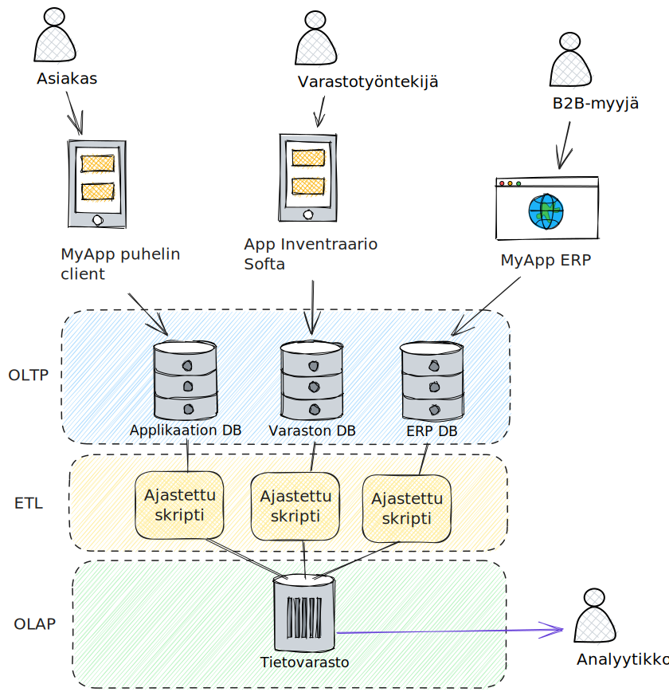

# OLAP vs OLTP

## Perusteet

Tietokannat voidaan jakaa kahteen luokkaan käyttötarkoituksen mukaan: operatiivisiin kantoihin ja tietovarastoihin (eng. data warehouse). Operatiiviset transaktiokannat käsittelevät tilauksia, varauksia, ottoja ja muita tilamuutoksia pääasiassa rivi errallaan. Nämä tuotannon kannalta kriittiset kannat eivät tyypillisesti tallenna historiadataa vaan edustavat datan nykytilannetta. Tietovarastot toimivat hyvin päinvastaisesti: tietokannan haut käsittelevät useita tuhansia tai miljoonia rivejä kerrallaan, ja haettu tieto edustaa esimerkiksi keskimääräistä varausmäärää per tietty asiakassektori. Näille tiedon käsittelyn malleille on vakiintuneet lyhenteet: tietovarastokäyttöä vastaa lyhenne OLAP (Online Analytics Processing), ja operatiivisten kantojen käyttöä OLTP (Online Transaction Processing). Mallien eroavaisuudet on esitelty alla olevassa taulukossa.



**Kuvio 1**: *Eri applikaatioiden data virtaa usein eri kantoihin. Data saatetaan kerätysti yhteen tietovarastoon, jotta analyytikko, ylin johto, tai joku muu yrityksen sisäinen taho voi sitä tarkastella.*

|                       | OLTP                                                                                                                                       | OLAP                                                                                                             |
| --------------------- | ------------------------------------------------------------------------------------------------------------------------------------------ | ---------------------------------------------------------------------------------------------------------------- |
| Toiminta-ajatus       | Tallentaa ja palauttaa tietueita yrityksen päivittäisen toiminnan takaamiseksi.                                                            | Tukee päätöksentekoa ja mahdollistaa datan louhinnan ja analysoinnin.                                            |
| Tyypillinen haku      | Loppukäyttäjä sovelluksen käyttöliittymän kautta. Pieni määrä rivejä, jotka löydetään primääriavaimella tai muulla indeksoidulla kentällä. | Data-analyytikko SQL-kyselyllä. Usein aggregoitua dataa, jota on suodatettu tai ryhmitelty sarakearvojen mukaan. |
| Tyypillinen kirjoitus | Yksittäiseen riviin kohdistuva  kirjoitus tai muutos.                                                                                      | Suuri erä rivejä ajastetussa ETL-prosessissa.                                                                    |
| Kyselyn laajuus       | Yksittäinen tietue eli rivi, joka haetaan sen id:tä tai avainta vasten                                                                     | Useita tietueita tai niiden aggregaatti (esimerkiski keskiarvo).                                                 |
| Viive                 | Nano- tai millisekunteja.                                                                                                                  | Sekunteja tai tunteja.                                                                                           |

Erilaiset tiedon hakisen ja tallentamisen tarpeet vaikuttavat niin teknisiin ratkaisuihin kuin tiedon loogisen malliin.


## OLAP-kuutio

Tulet törmäämään väkisinkin käsitteeseen *OLAP-kuutio* tai *datakuutio*. Tietokoneella tiedosto on pitkä sarja tavuja, joten tallennustilasta et suinkaan tule löytämään kolmiulotteista könttiä bittejä ja nollia. Helpoin tapa lähestyä tätä lienee esimerkki, joten siirrytään suoraan tauluun:

### 🐧 Käsiteltävä data

Käsitellään kuvitteellista pingviinidataa. Data myötäilee `seaborn-data/penguing.csv`-tiedostoa, johon törmäät mitä todennäköisemmin jossain vaiheessa data-osaajan uraasi tutoriaaleissa. 

Jotta esimerkki pysyy helppona, pidetään vain kolme ulottuvuutta: **species**, **island** ja **sex**. Ainut käytettävä metriikka on *count* eli havaintojen määrä kullekin yhdistelmälle. Kenttää ei luonnollisesti löydy alkuperäisestä taulusta vaan se aggregoidaan SQL-kyselyn yhteydessä. Taulun rakenne on siis seuraavanlainen:

| species   | island    | sex    | body_mass_g |
| :-------- | :-------- | :----- | ----------: |
| Adelie    | Torgersen | female |        3730 |
| Adelie    | Torgersen | female |        3200 |
| Adelie    | Biscoe    | male   |        3850 |
| Adelie    | Dream     | female |        3150 |
| Adelie    | Dream     | male   |        3700 |
| Adelie    | Dream     | female |        3050 |
| Chinstrap | Dream     | male   |        3800 |
| Chinstrap | Dream     | female |        3150 |
| Chinstrap | Torgersen | male   |        3700 |
| Chinstrap | Torgersen | female |        3050 |
| Chinstrap | Biscoe    | male   |        3750 |
| Chinstrap | Biscoe    | female |        3100 |
| Gentoo    | Biscoe    | male   |        5250 |
| Gentoo    | Biscoe    | female |        4800 |
| Gentoo    | Dream     | male   |        5250 |
| Gentoo    | Dream     | female |        4850 |

### Helppo metodi

Monet tietokannat tukevat `GROUP BY CUBE`-koontia, joka mahdollistaa OLAP-kuution hyvinkin helposti. Alla koodi:

```sql
SELECT 
    species, 
    island, 
    sex, 
    COUNT() as penguins
FROM penguins
GROUP BY CUBE (species, island, sex);
```

Kysely tuottaa 44 riviä dataa, joten en aseta sitä kerralla näytille. Sen sijaan käydään läpi se, kuinka saman tuloksen voisi saavuttaa manuaalisesti kasaamalla.

### Työläs metodi

OLAP-kuution voi kasata yhdistämällä päällekäin (`UNION ALL`) useat eri queryt, joista kukin tuottaa joidenkin ulottuvuuksien määrän. Tarvitsemme yhteensä 8 querytä, jotka tuottavat seuraavat yhdistelmät:

* (`N/A`) - Grand total
* (`sex`) - Group by sex
* (`species`)
* (`island`)
* (`species`, `island`) - Group by species and island
* (`species`, `sex`)
* (`island`, `sex`)
* (`species`, `island`, `sex`) - Group by all three dimensions

#### Grand Total

```sql
SELECT NULL AS species, NULL AS island, NULL AS sex, COUNT(*) AS penguins
FROM penguins;
```

| species | island | sex | penguins |
| ------- | ------ | --- | -------- |
|         |        |     | 16       |

Yhteensä pingviinejä on 16, joten tämä rivi on itsestäänselvyys. Tyhjä kenttä tarkoittaa arvoa NULL.

#### Group by sex

```
SELECT NULL AS species, NULL AS island, sex, COUNT(*) AS penguins
FROM penguins
GROUP BY sex
```

| species | island | sex    | penguins |
| ------- | ------ | ------ | -------- |
|         |        | male   | 7        |
|         |        | female | 9        |

Yhteensä pingiinejä on yhä 16, luonnollisesti, mutta tämän dimension mukaan määrä jakautuu 7 urokseen ja 9 naaraaseen.

Kyselyt (`island`) ja (`species`) ovat hyvin samanlaiset. Korvaa `GROUP BY metriikka` ja aseta muut kentät tilaan NULL.

#### Group by species-island

```sql
SELECT species, island, NULL AS sex, COUNT(*) AS penguins
FROM penguins
GROUP BY species, island
```

| species   | island    | sex  | penguins |
| :-------- | :-------- | :--- | -------: |
| Adelie    | Biscoe    | <NA> |        1 |
| Adelie    | Dream     | <NA> |        3 |
| Adelie    | Torgersen | <NA> |        2 |
| Chinstrap | Biscoe    | <NA> |        2 |
| Chinstrap | Dream     | <NA> |        2 |
| Chinstrap | Torgersen | <NA> |        2 |
| Gentoo    | Biscoe    | <NA> |        2 |
| Gentoo    | Dream     | <NA> |        2 |

Pingviinejä on vieläkin 16, mutta laji-saari -yhdistelmällä niiden määrät jakautuvat näin.

Kuten yllä, muut kahta ulottuvuutta ryhmittävät kyselyt ovat täysin samanlaisia kuin tämä. Vaihta `GROUP BY metriikka1, metriikka2` toiseksi ja korvaa kolmas metriikka arvolla `NULL`.

#### Valmis query

Lopulta sama toistetaan myös kolmella ulottuvuudella, ja kaikki queryt yhdistetään päällekäin `UNION ALL`-komennolla. Koko kysely näyttää siis tältä:

```sql
-- Group by (species, island, sex)
SELECT species, island, sex, COUNT(*) AS penguins
FROM penguins
GROUP BY species, island, sex

UNION ALL

-- Group by (species, island)
SELECT species, island, NULL AS sex, COUNT(*) AS penguins
FROM penguins
GROUP BY species, island

UNION ALL

-- Group by (species, sex)
SELECT species, NULL AS island, sex, COUNT(*) AS penguins
FROM penguins
GROUP BY species, sex

UNION ALL

-- Group by (island, sex)
SELECT NULL AS species, island, sex, COUNT(*) AS penguins
FROM penguins
GROUP BY island, sex

UNION ALL

-- Group by (species)
SELECT species, NULL AS island, NULL AS sex, COUNT(*) AS penguins
FROM penguins
GROUP BY species

UNION ALL

-- Group by (island)
SELECT NULL AS species, island, NULL AS sex, COUNT(*) AS penguins
FROM penguins
GROUP BY island

UNION ALL

-- Group by (sex)
SELECT NULL AS species, NULL AS island, sex, COUNT(*) AS penguins
FROM penguins
GROUP BY sex

UNION ALL

-- Grand total (no grouping columns)
SELECT NULL AS species, NULL AS island, NULL AS sex, COUNT(*) AS penguins
FROM penguins;
```

### Kuution kysely

Kysely tuottaa 43 riviä dataa, joten en aseta sitä kerralla näytille. Sen sijaan kokeillaan, kuinka sitä voi käsin plärätä. Huomaa, että sarake `penguins` ei suinkaan ole metriika siten, että sitä voisi summata sokkona. Jos näin tekee, meillä on mukamas 128 pingviiniä:

#### ⛔ Grand Total

```sql
SELECT SUM(penguins) AS total_penguins FROM cube_penguins;
```

| total_penguins |
| -------------: |
|            128 |

Tämä on varsin luontevaa, koska meillä on 8 eri ryhmää, joissa kussakin on 16 pingviiniä, ja `8 x 16 == 128`.

#### ✅ Grand Total (oikea tapa)

```sql
SELECT penguins AS total_penguins
FROM cube_penguins
WHERE 
    species IS NULL AND
    island IS NULL AND
    sex IS NULL;
```

| total_penguins |
| -------------: |
|             16 |

### Tarkemmat kyselyt

Jatkossa voimme tarkistaa määrän minkä tahansa dimensioiden yhdistelmän mukaan siten, että otamme halutut dimensiot mukaan, ja `WHERE`-lausekkeessa säädämme niiden filtteriä `IS` tai `IS NOT NULL`-lausekkeilla. Lienee helppo kuvitella, että tämä voisi olla graafisessa käyttöliittymässä laatikko, johon voi raahata haluamansa dimensiot.

Alla kaksi esimerkkiä selvyyden vuoksi.

#### By (species)

```sql
SELECT species, penguins AS total_penguins
FROM cube_penguins
WHERE 
    species IS NOT NULL AND -- huomaa NOT
    island IS NULL AND
    sex IS NULL;
```

| species   | total_penguins |
| :-------- | -------------: |
| Adelie    |              6 |
| Chinstrap |              6 |
| Gentoo    |              4 |

#### By (species, island)

```sql
SELECT species, island, penguins 
FROM cube_penguins
WHERE 
    species IS NOT NULL AND -- huomaa NOT
    island IS NOT NULL AND -- huomaa NOT
    sex IS NULL;
```

| species   | island    | penguins |
| :-------- | :-------- | -------: |
| Adelie    | Biscoe    |        1 |
| Adelie    | Dream     |        3 |
| Adelie    | Torgersen |        2 |
| Chinstrap | Biscoe    |        2 |
| Chinstrap | Dream     |        2 |
| Chinstrap | Torgersen |        2 |
| Gentoo    | Biscoe    |        2 |
| Gentoo    | Dream     |        2 |

## Onko kuutio pakollinen?

Huomaa, että esimerkiksi `by (species, island)`-kyselyn olisi voinut suorittaa alkuperäiseen tauluun näin:

```sql
SELECT species, island, COUNT(*) AS penguins
FROM penguins
GROUP BY species, island;
```

Kuutio ==ei siis== mitenkään maagisesti tarjoa jotakin uutta *3-ulotteista slice'n'dice ominaisuutta*, vaan yksinkertaisesti sisältää valmiiksi tauluun leivotut aggregaatit. Tämä keventää BI-työkalun laskentakuormaa kun valitsimia valitaan.

### Lisätietoa

Jos kaipaat syventävää selitystä OLAP-kuutioista, katso Stanfordin yliopiston Jennifer Widomin [Introduction to Databases](https://youtube.com/playlist?list=PLroEs25KGvwzmvIxYHRhoGTz9w8LeXek0&si=7J6IkuXfXf2QIezF)-soittolistan loppupuolen videot. Tunnistat ne `olap`-sanasta otsikossa.