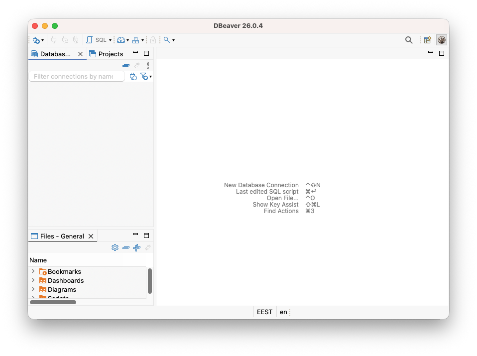
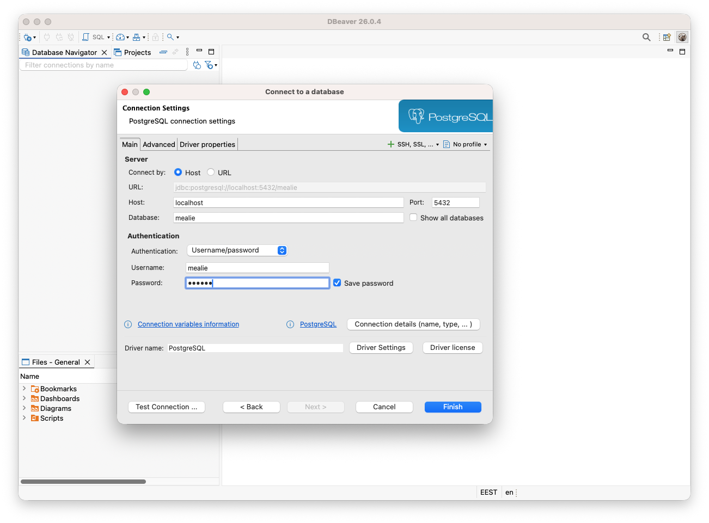
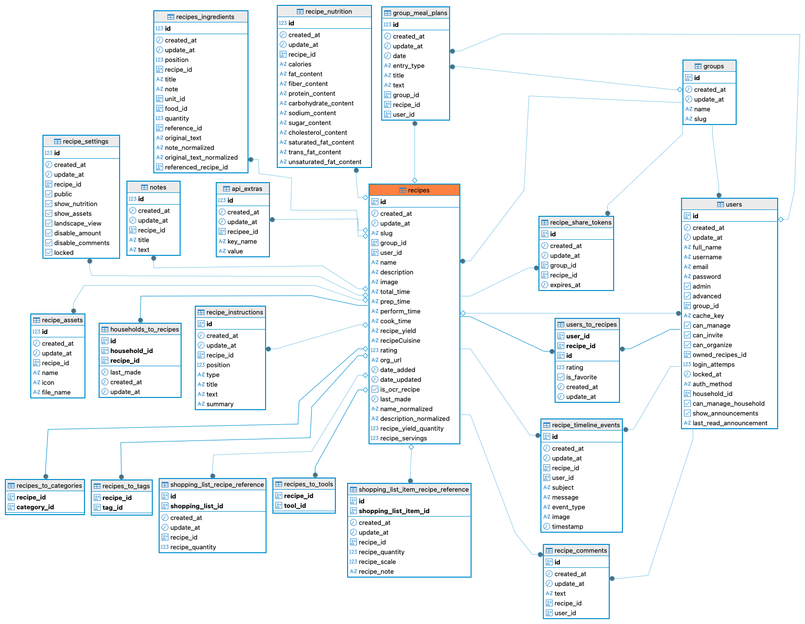
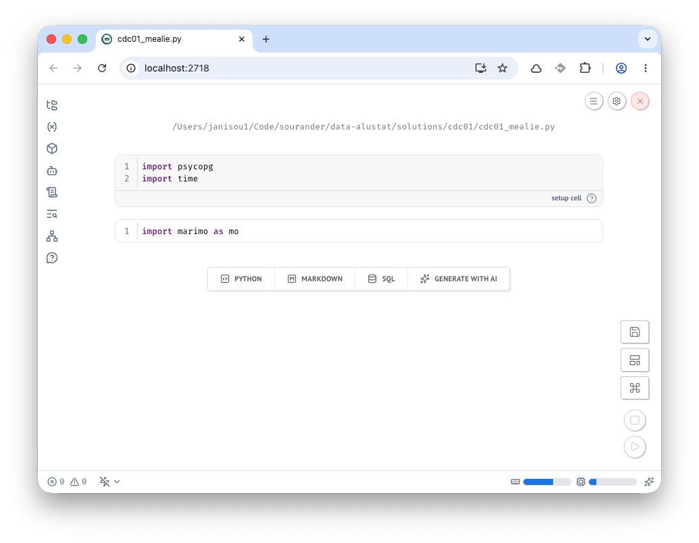

# CDC01: Mealie

CDC (Change Data Capture) tarkoittaa muutosten seuraamista tietokannassa. Tässä harjoituksessa käytetään PostgreSQLin loogista replikointia ja tarkkaillaan tietokannan muutoksia reaaliaikaisesti.

## Esivaatimukset

- Docker ja Docker Compose
- Python (`psycopg-binary`-kirjasto)
- Marimo Notebook (`marimo[recommended]`) tai normaali Python-tulkki

## Valmistelut: PostgreSQL-looginen replikointi

Luo hakemisto harjoitustasi varten, esimerkiksi `mealie-harjoitus/`. Lisää sinne alla oleva `compose.yaml`. Referenssisisällön voit lainanata [Mealie: Installing with PostgreSQL](https://docs.mealie.io/documentation/getting-started/installation/postgres/)-dokumentaatiosta tai alta. Jos tutkit eroavaisuuskia, huomaat esimerkiksi `POSTGRES_INITDB_ARGS`-ympäristömuuttuja narvon `--wal-level=logical`, joka on lisätty loogisen replikoinnin mahdollistamiseksi.

```yaml
services:
  postgres:
    image: postgres:17
    command: postgres -c wal_level=logical
    environment:
      POSTGRES_USER: mealie
      POSTGRES_PASSWORD: mealie
      POSTGRES_DB: mealie
    volumes:
      - mealie-pgdata:/var/lib/postgresql/data
    ports:
      - "5432:5432"
    healthcheck:
      test: ["CMD", "pg_isready"]
      interval: 30s
      timeout: 20s
      retries: 3

  mealie:
    image: ghcr.io/mealie-recipes/mealie:v3.17.0
    container_name: mealie
    restart: always
    ports:
      - "9925:9000"
    deploy:
      resources:
        limits:
          memory: 1000M
    volumes:
      - mealie-data:/app/data/
    environment:
      ALLOW_SIGNUP: "false"
      PUID: 1000
      PGID: 1000
      TZ: Europe/Helsinki
      BASE_URL: http://localhost:9925
      DB_ENGINE: postgres
      POSTGRES_USER: mealie
      POSTGRES_PASSWORD: mealie
      POSTGRES_SERVER: postgres
      POSTGRES_PORT: 5432
      POSTGRES_DB: mealie
    depends_on:
      postgres:
        condition: service_healthy

volumes:
  mealie-data:
  mealie-pgdata:
```

Käynnistä palvelu:

```bash
docker compose up -d
```

## Tehtävänanto

Seuraa PostgreSQLin loogisen replikoinnin dokumentaatiota ja toteuta alla kuvattu järjestelmä.

### 1. Kirjaudu sisään

Kirjaudu Mealie-käyttöliittymään osoitteessa `http://localhost:9925`. UI tarjoaa sinulle vakiokäyttäjää `changeme@example.com:MyPassword`.

### 2. Luo käyttäjä

Mealie pakottaa sinut luomaan uuden käyttäjän. Käytä esimerkiksi sähköpostia `myself@example.local`.

### 3. Tee resepti

Tee vähintään yksi resepti. Käytä `Import with URL`-toimintoa säästääksesi aikaa. Esimerkiksi [Hapanimeläkana (haudutusversio)](https://www.kotikokki.net/reseptit/nayta/889533/Hapanimel%C3%A4kana%20%28haudutusversio%29/) ja/tai [Helppo porkkanakakku](http://localhost:9925/g/home/r/helppo-porkkanakakku).

Tosielämässä sinun tulisi parsia ainekset ja niiden määrät erikseen, mutta tässä harjoituksessa voimme antaa datan laadun mennä kohti kaaosta.

### 4. Tutustu tauluihin

Nyt sinulla pitäisi olla PostsgreSQL:ssä tauluja, joiden **muutoshistoriaa** me aiomme seurata tässä harjoituksessa. Helppo tapa tutustua tauluihin ja niiden ER-kaavioon on käyttää graafista työkalua, joista suosittelen [DBeaveria](https://dbeaver.io/download/).



**Kuva 1:** Asennuksen jälkeen Dbeaver näyttää tältä. Klikkaa aivan vasemmasta yläreunasta plussa-ikonia tai paina ohjeistettua *New database connection* -pikanäppäintä.



**Kuva 2:** Valitse listasta PostgreSQL ja klikkaa *Next*. Aukeaa kuvassa näkyvä *Connection settings*. Syötä `compose.yaml`-tiedostossa määritellyt käyttäjätiedot.

Kun tiedot on syötetty, klikkaa Test Connection. Jo/kun DBeaver kysyy ajurin lataamisesta, hyväksy lataus. Kun yhteys onnistuu, klikkaa Finish.

### 5. Tutustu ER-kaavioon

Taulu `recipes` on ilmiselvästi keskeinen reseptien luomisessa. Etsi se DBeaverin vasemman laidan navigointipaneelista. Polku on: `mealie -> Schemas -> public -> Tables -> recipes`. Klikkaa taulua hiiren oikealla ja valitse *View Diagram*. Näet ER-kaavion, joka näyttää taulun `recipes` ja sen suhteet muihin tauluihin.



**Kuva 3:** ER-kaavio näyttää taulun `recipes` ja sen suhteet muihin tauluihin. Dbeaver räjäyttää kaavion automaattisesti; tätä kuvaa opettaja on hieman järjestänyt uusiksi.


!!! tip "Yhteys tietomallinnukseen"

    Jos yrityksen valitsema tapa integroida Mealia-data tietovarastoon on suora haku kannasta (ja WAL tai Binary Log CDC), niin tietovaraston Bronze-kerrokselle päätyvät kaikki valitut taulut `as-raw-as-possible`-kopioina. CDC-data tuo mukanaan pelkän tilan lisäksi muutostiedon, kuten `INSERT`, `UPDATE`, tai `DELETE`. Näin tietovarastossa voidaan säilyttää täydellinen historia siitä, miten data on muuttunut ajan myötä. 
    
    Silver ja/tai Gold-tasoilla tietoa voidaan jalostaa esimerkiksi nykytilan mukaiseksi tai historiatauluiksi. Koska näin monen taulun yhdistäminen on työlästä loppukäyttäjälle, tämä tieto tyypillisesti mallinnettaisiin tavalla tai toisella **bisnestermien** mukaiseksi. Yksi käytetyimmistä tavoista on ns. Kimball dimensiomallinnus. Kyseiseessä mallinnuksessa käytetään faktatauluja, kuten `f_recipes`, ja dimensioita, kuten `d_ingredients`. Esimerkiksi Mealien many-to-many aputaulu `users_to_recipes` voisi olla hyvä ehdokas faktatauluksi, joka edustaa käyttäjien luomien reseptien historiaa. Jos ajat `GROUP_BY user_id` ja lasket summan, saat tietää, kuinka monta reseptiä kukin käyttäjä on luonut.

### 6. Luo Marimo Notebook

Luo sandbox Marimo Notebook, joka käyttää `inline`-riipuuvuuksia. Näin et tarvitse erillistä virtuaaliympäristöä, vaan se luodaan tarpeen mukaan automaattisesti. Jotta pääsisit helpolla, opettaja on luonut pohjan, jossa oikeat riippuvuudet ovat valmiiksi paikoillaan. Luo siis `cdc01_mealie.py` tiedosto valitsemaasi hakemistoon. Lisää sisältö:

```python title="cdc01_mealie.py"
# /// script
# dependencies = [
#     "marimo[recommended]",
#     "psycopg[binary]",
# ]
# requires-python = ">=3.13"
# ///

import marimo

__generated_with = "0.23.6"
app = marimo.App(width="medium")

with app.setup:
    import psycopg
    import time


@app.cell
def _():
    import marimo as mo

    return


if __name__ == "__main__":
    app.run()
```

Aja tiedosto ylös komennolla:

```bash
uvx marimo edit --sandbox cdc01_mealie.py
```



!!! tip

    Jos haluat joskus luoda vastaavia itse, keino on ajaa `uvx marimo edit --sandbox <tiedostonimi.py>`. Jos tiedostoa ei ole vielä olemassa, se luodaan. Voi hallinnoida riippuvuuksia tämän jälkeen Marimon graafisen käyttöliittymän avulla, mutta ainakin minä koen helpoimmaksi muokata joitakin dependencyjä suoraan `.py`-tiedostosta manuaalisesti. Yksi syy tälle on se, että saatat haluta tietyt extrat kerralla mukaan, kuten: `marimo[recommended]` tai `psycopg[binary]`. Esimerkiksi tämä Notebook ei toimi, jos `[binary]`-extrat puuttuvat.

### 6. Hae CDC-dataa

Opettaja on luonut jo valmiiksi luokan `MealieCDCStream`, jota voit käyttää. Sen koko toteutus on alla:

```python  title="cdc01_mealie.py"
# Nämä ovat setup cell:n sisällä jo
# import psycopg
# import time

class MealieCDCStream:
    def __init__(self, dsn, slot_name="cdc_lab_slot"):
        self.dsn = dsn
        self.slot_name = slot_name

    def stream_events(self) -> dict:
        """A Python generator that continuously yields CDC events one by one."""
        with psycopg.connect(self.dsn, autocommit=True) as conn:
            with conn.cursor() as cur:
                # Silently ensure the replication slot exists
                try:
                    cur.execute(f"SELECT pg_create_logical_replication_slot('{self.slot_name}', 'test_decoding')")
                except psycopg.errors.DuplicateObject:
                    pass 

                # Continuously poll and yield events
                while True:
                    cur.execute(f"SELECT lsn, xid, data FROM pg_logical_slot_get_changes('{self.slot_name}', NULL, NULL)")
                    for lsn, xid, data in cur.fetchall():
                        
                        # Package the raw data into a dictionary.
                        yield {
                            "lsn": lsn, 
                            "transaction_id": xid, 
                            "payload": data
                        }
                    
                    time.sleep(2)
```

!!! tip

    Oppimisen kannalta voi olla hyvä tutustua yllä oleviin SQL-käskyihin. Esimerkiksi [test_decoding](https://pgpedia.info/t/test_decoding.html) on PostgreSQLin mukana tuleva loogisen replikoinnin dekooderi, joka muuntaa WAL-tiedot luettavaksi tekstiksi. Tämän tilalla voisi hyvin käyttää esimerkiksi [wal2json](https://github.com/eulerto/wal2json)-dekooderia, joka tuottaa JSON-muotoista dataa, mutta se vaatii asennuksen esim. Linux-jakelin paketinhallinnasta.

Luo toiseen soluun komennot, jotka toimivat tämän luokan ajurina:

```python title="cdc01_mealie.py"
DB_DSN = "host=localhost port=5432 dbname=mealie user=mealie password=mealie"
stream = MealieCDCStream(DB_DSN)

print("Listening for Mealie database events... (Halt Notebook to stop)")

try:
    for event in stream.stream_events():
        print(f"[{event['lsn']}] TXID {event['transaction_id']}: {event['payload']}")
except KeyboardInterrupt:
    print("\nShutdown signal received! Cleaning up...")
```

Aja solu. Se jää suorittamaan itse itseään loputtomiin. Kun painat *Stop*-näppäintä Marimo Notebookissa, Marimo lähettää `KeyboardInterrupt`-poikkeuksen, joka saa streamin lopettamaan ja tulostamaan "Cleaning up".

!!! tip

    Tuloste sanoo "Cleaning up", mutta me emme oikeasti toteuta mitään siivousta. Tuotannossa meidän tulisi poistaa luotu replication slot, jotta emme aiheuta tarpeetonta kuormaa tietokannalle.

### 7. Tee muutoksia

Palaa Mealie-käyttöliittymään ja tee muutoksia. Esimerkiksi:

1. Luo uusi resepti. (importoi resepti URL:sta, kuten aiemmin)
2. Muokkaa olemassa olevan reseptin nimeä.
3. Poista resepti.

Tutki joka välissä, mitä tulostuu Marimo Notebookiin. Tulet löytämään seuraavanlaisia rivejä (rivitetty ja osa sarakkeista poistettu luettavuuden vuoksi):

```
[0/1CBFB28] TXID 775: table public.recipes: 
INSERT: 
  created_at[timestamp without time zone]:'2026-05-15 06:20:36.626034'
  update_at[timestamp without time zone]:'2026-05-15 06:20:36.626034' 
  id[uuid]:'4af9c0f1-8573-421b-9aed-c6240e9b0c8c' 
  slug[character varying]:'cheddar-perunarosti' 
  group_id[uuid]:'e7822c7c-24f8-46ee-ba5c-05f587700413'
  user_id[uuid]:'7fe1d27a-096d-43a4-806b-5c21ee89a6cd'
  name[character varying]:'Cheddar-perunarösti'
  description[character varying]:'Rapea juusto-perunarösti lohella on ...' 
  total_time[character varying]:'1 hour'
  prep_time[character varying]:'1 hour'
  org_url[character varying]:'https://www.valio.fi/reseptit/cheddar-perunarosti/'
  date_added[date]:'2026-05-15'
  date_updated[timestamp without time zone]:'2026-05-15 06:20:36.625323'
  recipe_servings[double precision]:4
```

Toinen event voi näyttää tältä:

```
[0/1CCD568] TXID 777: table public.recipes: 
UPDATE: 
  created_at[timestamp without time zone]:'2026-05-15 06:20:36.626034'
  update_at[timestamp without time zone]:'2026-05-15 06:25:49.726672'
  id[uuid]:'4af9c0f1-8573-421b-9aed-c6240e9b0c8c'
  slug[character varying]:'cheddarperunarosti'
  group_id[uuid]:'e7822c7c-24f8-46ee-ba5c-05f587700413'
  user_id[uuid]:'7fe1d27a-096d-43a4-806b-5c21ee89a6cd'
  name[character varying]:'Cheddarperunarösti'
  description[character varying]:'Rapea juusto-perunarösti lohella on ...' 
  total_time[character varying]:'1 hour'
  prep_time[character varying]:'1 hour'
  org_url[character varying]:'https://www.valio.fi/reseptit/cheddar-perunarosti/'
  date_added[date]:'2026-05-15'
  date_updated[timestamp without time zone]:'2026-05-15 06:25:49.724575'
  recipe_servings[double precision]:4
```

Näitä tapahtumia voi luonnollisesti koneella parsia. Pseudoesimerkki olisi seuraava:

```
+---+------------------------------+---+-------------------+--------+-----------+----+-------------------+-------------------+
| Op|      ingestion_tool_timestamp| id|        slug       |group_id|    user_id| ...|            created|           modified|
+---+------------------------------+---+-------------------+--------+-----------+----+-------------------+-------------------+
| I |2026-05-15 06:20:36           | 1 |cheddar-perunarosti|...     |...        | ...|2026-05-15 06:20:36|2026-05-15 06:20:36|
| U |2026-05-15 06:25:49           | 1 |cheddarperunarosti |...     |...        | ...|2026-05-15 06:20:36|2026-05-15 06:25:49|
+---+------------------------------+---+-------------------+--------+-----------+----+-------------------+-------------------+
```

Nämä muutokset voi tallentaa esimerkiksi jonoon (kuten Kafka) tai tallentaa staging-arealle (kuten verkkolevy, S3, tai kevyt tietokanta). Tästä väliaikaisesta säilöstä ne voidaan noutaa esimerkiksi 30 minuutin erinä tietovarastoon. Tai, voi ne toki striimata sinne suoraankin – mutta älä odota, että useimmat OLAP-järjestelmät tulisivat toimeen tuhansien tapahtumien sekuntivauhdilla ilman, että suorituskyky kärsii, tai kustannukset räjähtävät.

!!! warning "Termistösekaannus"

    On tärkeää tunnistaa, että CDC (Change Data Capture) on prosessi, jossa haetaan *muutostiedot* jostakin järjestelmästä. Tämän voi tehdä monilla eri tavoin. Näitä ovat esimerkiksi:

    1. Tee full load koko taulusta joka päivä. Laske muutokset vertailemala vanhaa ja uutta.
    2. Nouda muutokset `modified`-kentän avulla. Tämä vaatii, että tauluista löytyy se. Lisäksi poistot eivät tule läpi. Et voi noutaa sitä, mitä ei enää ole.
    3. Käytä tietokannan replikointiin (ja muuhun) tarkoitettua WAL (Write-Ahead Log) tai Binary Log -striimiä. Se sisältää kaikki muutokset, mukaan lukien DDL (Data Definition Language) ja DELETE-operaatiot.

    Kaupallisia tuotteita, jotka kykenevät viimeiseen, ovat esimerkiksi Fivetran, AWD DMS ja Airbyte (Debezium). Jälkimmäisen sivuilta löytyy avulias [Understanding Change Data Capture (CDC): Definition, Methods and Benefits](https://airbyte.com/blog/change-data-capture-definition-methods-and-benefits) artikkeli.

    Kukaan ei tietenkään kiellä noukkimasta dataa Pythonilla. Löydät Github Gist -sivulta tuotantovalmiin, asynkronisen toteutuksen. Tämän Richard Brandesin luoman toteutuksen osoite on [RPG-fan/psycopg3_logical_replication.py](https://gist.github.com/RPG-fan/b6d578e45712ae9467b05d6ac4e8dbc6). Lisenssi on MIT, joten voit käyttää ja muokata sitä melko vapaasti.

### 8. Tuhoa kaikki

Lopulta voit sammuttaa Marimo Notebookin aja ajaa komennon:

```bash
docker compose down -v
```

## Videolla esitettävä

Tässä harjoituksessa videon tulee osoittaa vähintään seuraavat asiat:

1. Kerrot, kuinka monta tuntia käytit harjoitukseen.
2. Selität lyhyesti, mikä on WAL ja miten se liittyy Replication Slotteihin.
3. Selität lyhyesti, mitä on CDC (Change Data Capture) ja miksi sellaista käytetään.
4. Näytät DBeaverista tai vastaavasta työkalusta `recipes`-taulun tai sen ER-kaavion.
5. Käynnistät Marimo Notebookissa CDC-striimin (käyttäen `MealieCDCStream`-luokkaa).
6. Menet Mealien käyttöliittymään ja teet tietokantamuutoksen (luot, päivität tai poistat reseptin).
7. Palaat Marimo Notebookiin ja näytät, kuinka tekemäsi muutos ilmestyi CDC-tulosteeseen.
