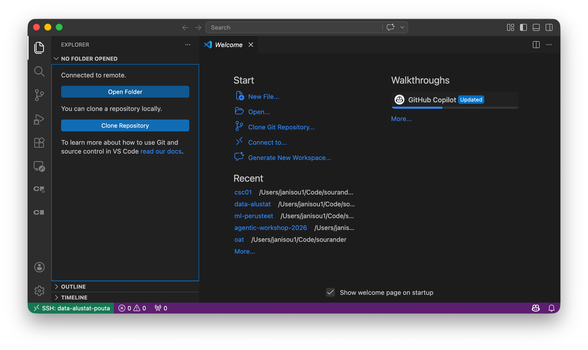
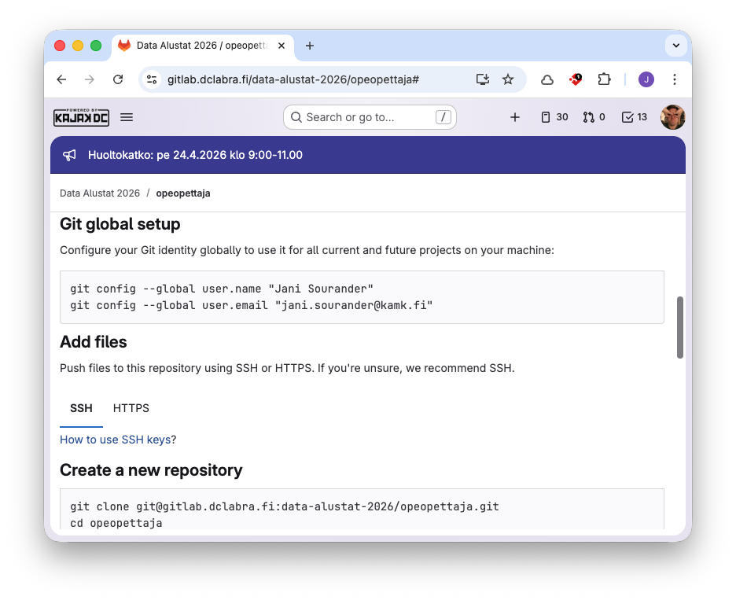
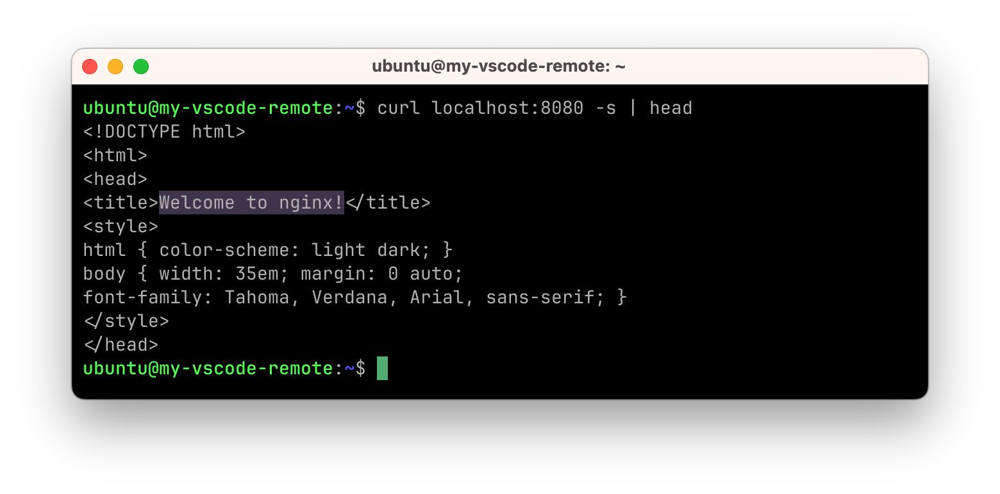
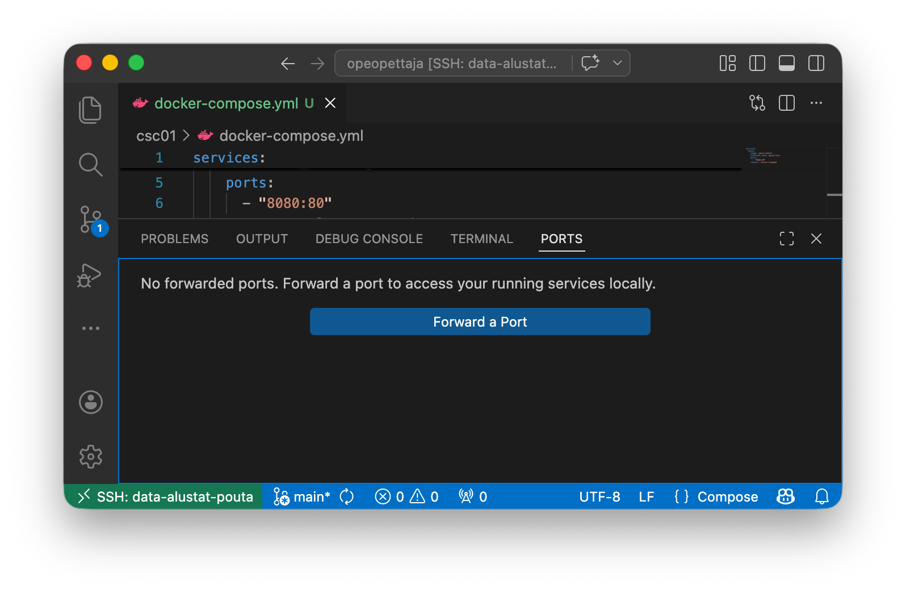
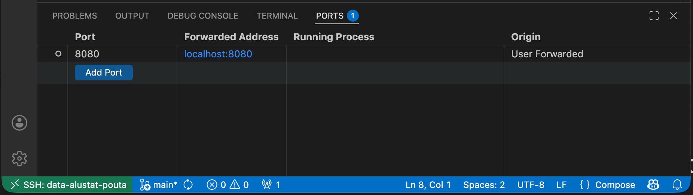
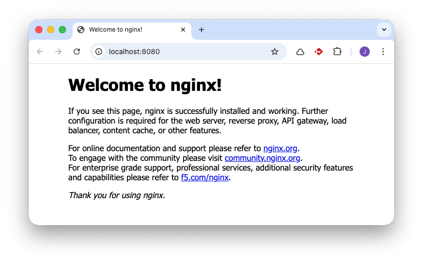
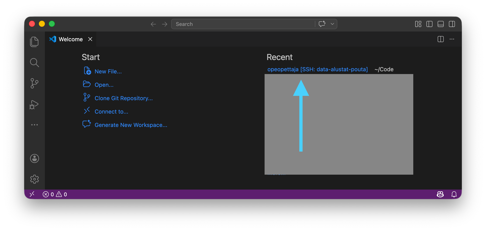

# CSC01: cPouta

Tässä harjoituksessa otat käyttöön CSC:n cPouta -pilvipalvelun. Tämä tehtävä on erityisen hyödyllinen, jos (1) haluat oppia käyttämään CSC:n pilvialustaa tämän kurssin harjoituksissa, (2) haluat voida hyödyntää CSC:n virtuaalikoneita myöhemmissä projekteissa, tai (3) sinulla on rajoitetusti resursseja omalla koneellasi (esim. vanha, hidas kannettava tietokone). Kaupan päälle saat hieman Linux-kokemusta. Mikäli haluat ajaa kaiken omalla koneellasi, siirry toisiin harjoituksiin.

## Alkuvaiheet

Tee nämä ajoissa, koska Account ja/tai Project luomiseen voi mennä tunteja.

* Luo CSC Account
    * Tähän käytetään korkeakoulun tarjoamia HAKA-tunnuksia.
* :clock: Odota, että saat CSC:ltä sähköpostia, että Account on luotu. Tässä voi mennä tunteja.
* Luo CSC Student Project
    * Tämä neuvotaan CSC:n sivuilla: [Creating a new project: Student](https://docs.csc.fi/accounts/how-to-create-new-project/#student)
    * Lisää cPouta-palvelu projektiin luomisvaiheessa (tai myöhemmin).
* :clock: Odota, että saat CSC:ltä sähköpostia, että alusta on valmis. Tässä voi mennä tunteja.

## Tehtävänanto

Kun alkuvaiheet on tehty, tee alla olevat vaiheet. Jos haluat video-ohjeen, voit tutustua [cPouta and ePouta related videos](https://docs.csc.fi/cloud/pouta/tutorials/pouta-videos/)-sivun sisältöön.

### cPouta

#### 1. Luo virtuaalikone

* Kirjaudu sisään [pouta.csc.fi](https://pouta.csc.fi/) -palveluun.
* Lisää SSH-avainpari CSC cPouta -palveluun.
    * Ohjeet CSC:n sivuilta: [Pouta > Tutorials > SSH Key Pair](https://docs.csc.fi/cloud/pouta/tutorials/ssh-key/)
    * Huomaa, että sinulla todennäköisesti on jo avain. Tälle on oma *"Adding an existing key pair to OpenStack"*-ohje samalla sivulla.
* Luo virtuaalikone (VM) cPouta-palveluun.

!!! tip "Koneen luominen"

    Tärkeimmät kohdat, joihin sinun tulee kiinnittää huomiota, ovat:

    * Valitse Linux-distribuutioksi (Source-välilehdellä) mieluiten Ubuntu 24.04 LTS (Long Term Support) tai uudempi, jos saatavilla.
    * Docker vaatii muistia. Valitse Flavour-välilehdeltä `standard.large` (4 vCPU, 8 GB RAM). Tämä kone kustantaa noin 2 BU/h, joten 3000 BU:n projektissa voit pitää konetta yhtäaikaisesti päällä noin 1500 tuntia eli noin 60 päivää. Alla neuvotaan, kuinka tätä voi säästää.

Kun kone on luotu, sinun tulee tehdä siitä julkisesti saavutettava, jotta voit käyttää sitä SSH:lla. Tämä tapahtuu luomalla koneelle julkinen IP-osoite ja sallimalla SSH-yhteydet koneeseen.

#### 2. Floating IP

* Luo IP-osoite, jota koneesi tulee julkisesti käyttämään: `Network > Floating IPs > Allocate floating IP address`.
* Liitä IP-osoite koneeseesi: `Network > Floating IPs > Associate`-näppäin. Valitse aiemmin luomasi tietokone listasta.

Tallenna tämä IP-osoite, koska tarvitset sitä myöhemmin. Se on esimerkiksi muotoa: `86.xxx.xxx.xxx`

#### 3. Security Group

* Luo Security Group, joka sallii SSH-yhteydet koneeseesi: `Network > Security Groups > Create Security Group`.
    * Anna Security Groupille nimi, esimerkiksi `ssh-access`.
    * Lisää Ingress-sääntö, joka sallii SSH-yhdeydet. Tähän löytyy valmis Rule, jonka voit valita alasvetovalikosta.
    * Lisäturvaa varten on suositeltavaa rajata Remote/CIDR säännöllä.
        * Selvitä oma IP (esim. `curl ifconfig.me`).
        * Lisää CIDR-muodossa, esimerkiksi `77.223.45.0/24`. Tämä sallii SSH-yhteydet vain IP-osoitteista, jotka alkavat `72.14.201.*`.
    * Liitä tämä Security Group koneeseesi: `Compute > Instances > Edit Security Groups`-näppäin. Valitse aiemmin luomasi Security Group listasta.

Lisää tässä välissä Security Group koneeseen. Mene `Compute > Instances`-näkymään, klikkaa koneesi oikealla puolella olevaa kolmea pistettä, ja valitse `Edit Security Groups`. Vasemmalla näkyy kaikki groupit, oikealla instanssiin kiinnitetyt. Paina vasemmalla näkyvän säännön vieressä pientä `+`-ikonia, jolloin se siirtyy oikealle ja tulee osaksi koneesi Security Groupia.

### Virtuaalikone kuntoon

#### 1. Testaa yhteyttä

Tässä välissä voit testata, että yhteys pelaa. Se hoituu seuraavasti:

```bash
ssh ubuntu@86.xxx.xxx.xxx
```

!!! warning

    Käytä IP-osoitetta, jonka sait CSC:ltä, ei tätä esimerkissä olevaa `86.xxx.xxx.xxx`-osoitetta.

#### 2. Asenna Docker

Tämä ei ole tuotannossa paras tapa, mutta nopea ja riittävä tähän harjoitukseen. Käytä Dockerin tarjoamaa tapaa [Install using the convenience script](https://docs.docker.com/engine/install/ubuntu/#install-using-the-convenience-script). Alla on komennot, kuten ne olivat 2026 keväällä:

```bash
curl -fsSL https://get.docker.com -o get-docker.sh
sudo sh ./get-docker.sh
```

Voit testata sen toimivuuden näin:

```bash
sudo docker run hello-world
```

!!! tip "Toimiko se?"

    Tunnistat oikean tulosteen siitä, että näet seuraavat rivit muiden rivien joukossa

    > Hello from Docker!
    >
    > This message shows that your installation appears to be working correctly.

#### 3. Anna ubuntu-käyttäjän ajaa Dockeria

Tämä neuvotaan ohjeessa [Linux post-installation steps for Docker Engine](https://docs.docker.com/engine/install/linux-postinstall/). Käsky on:

```bash
sudo groupadd docker
sudo usermod -aG docker $USER
newgrp docker
```

Ja nyt voit testata, että hello-world toimii myös `ubuntu`-käyttäjällä ilman `sudo`-komentoa:

```bash
docker run hello-world
```

#### 4. Tee palvelusta pysyvä

Varmista, että jos käynnistät koneen uusiksi, palvelu käynnistyy automaattisesti. Tämä tapahtuu komennolla:

```bash
sudo systemctl enable docker.service
sudo systemctl enable containerd.service
```

### VS Code

#### 1. Asenna Remote SSH

Käynnistä Visual Studio Code, ja...

* Asenna [Remote SSH](https://marketplace.visualstudio.com/items?itemName=ms-vscode-remote.remote-ssh)-lisäosa.

#### 2. SSH Config

Lisää seuraavat rivit sinun kotikansiosta löytyvään `~/.ssh/config`-tiedostoon. Tämän voi tehdä monella tapaa, mutta yksinkertainen on valita VS Code Command Palette (Ctrl+Shift+P), ja etsiä `Remote-SSH: Open SSH Configuration File...`-komentoa. Valitse avautuvasta listasta `~/.ssh/config`, jolloin se aukeaa VS Code:n ikkunaan. Lisää sinne seuraavat rivit:

```bash
Host data-alustat-pouta
    HostName 86.xxx.xxx.xxx
    User ubuntu
```

Tallenna tiedosto ja sulje se.

!!! warning

    Käytä IP-osoitetta, jonka sait CSC:ltä, ei tätä esimerkissä olevaa `86.xxx.xxx.xxx`-osoitetta.

#### 3. Remote SSH to cPouta

Valitse VS Coden Command Palettesta `Remote-SSH: Connect to Host...`-komento, ja valitse listalta `data-alustat-pouta`, jonka määrittelit `~/.ssh/config`-tiedostoon juuri äsken.

Nyt sinulle pitäisi aueta uusi VS Code -ikkuna, joka on yhteydessä cPouta-koneeseen.



**Kuva 1:** *VS Coden tyhjä näkymä, joka on yhteydessä cPouta-koneeseen.*

Avaa uusi Terminaali, ja luo siinä hakemisto, jossa haluat työskennellä, kuten:

```bash
mkdir -p ~/Code/etunimisukunimi
```

Tämän jälkeen voit painaa **Open Folder** -nappia, ja valita juuri luomasi hakemiston. Nyt kaikki, mitä teet tässä VS Code -projektissa, tapahtuu cPouta-koneellasi.

### GitLab



**Kuva 2:** *GitLab projekti, jonka opettaja on luonut sinua varten, on tyhjä. Alustetaan se repossa näkyvien ohjeiden avulla.*

Nämä vaiheet ovat käytännössä samoja, työskenteletkö lokaalisti vai cPouta-koneella. TLDR on, että:

1. Luo SSH-avainpari
2. Lisää julkinen avain GitLabiin
3. Seuraa GitLabin tyhjän repon ohjeita.

#### 1. Luo SSH-avainpari

Tämä on neuvottu tarkemmin [How to Git > Avaimen luonti](https://sourander.github.io/how-to-git/tunnistautuminen/ssh/ssh/)-ohjeissa, mutta lyhyt vastaus on, että **Avaa cPouta:ssa ajettavassa VS Code -ikkunassa Terminaali**, ja aja siellä:

```bash
ssh-keygen -t ed25519 -C "cPouta-data-alustat"
cat ~/.ssh/id_ed25519.pub
```

!!! warning

    En suosittele lisäämään avainpariin passphrasea. Avain on olemassa vain ja ainoastaan tässä yhdessä tietokoneessa, johon pääsee vain sinun omalla SSH-avainparillasi. Tiedosto on kohtalaisen turvassa.

    Jos nyt kuitenkin lisäät passphrasen, kannattaa opetella käyttämään `ssh-agent`-palvelua. Lyhyt ohje on:

    ```bash
    eval "$(ssh-agent -s)"
    # Tulostaa: Agent pid <PID nro>
    ssh-add ~/.ssh/id_ed25519
    # Tulostaa: Enter passphrase for /home/ubuntu/.ssh/id_ed25519: 
    #           Syötä passphrase, jonka loit, tämän jälkeen...
    # Tulostaa: Identity added: /home/ubuntu/.ssh/id_ed25519 (cPouta-data-alustat)
    ```

    Jatkossa nuo kaksi komentoa tulee ajaa aina kun avaat uuden istunnon. Passphrase kysytään siis kerran per sessio – esimerkiksi, kuten käynnistät VS Coden uusiksi.


#### 2. Lisää julkinen avain GitLabiin

Tämä sinun pitäisi tietää jo. Mene [GitLab > User Settings > SSH Keys](https://gitlab.dclabra.fi/-/user_settings/ssh_keys) ja liitä sinne julkinen avain. Mistäkö saat julkisen avaimen? Aja alla oleva komento Terminaalissa ja kopioi tulostuva teksti GitLabiin:

```bash
cat ~/.ssh/id_ed25519.pub
# Tulostaa esim.:
# > ssh-ed25519 AAAAC3NzaC1lZDI1NTE5AAAAIFWAp7fWqNYpu0Ht4bjsxdKkRW7x/4oNrXdzK+MIDxTn cPouta-data-alustat
```

#### 3. Noudata GitLabin ohjeita

Käytännössä vaiheet ovat tässä tapauksessa opettajan tiedoilla...

```bash
git config --global user.name "Jani Sourander"
git config --global user.email "jani.sourander@kamk.fi"
```

Lisää tiedosto, jotta commit on mahdollista...

```bash
touch README.md
```

Varsinainen kloonaus neuvotaan **Push an existing folder**-otsikon alla, joka olisi tässä tapauksessa...

```bash
git init --initial-branch=main --object-format=sha1
git remote add origin git@gitlab.dclabra.fi:data-alustat-2026/opeopettaja.git
git add .
git commit -m "Initial commit"
git push --set-upstream origin main
```

## Testaa käytännössä

Vihdoin, tylsät vaiheet ovat ohi. Nyt pistetään web-palvelin tulille! Luo hakemisto ja sinne `docker-compose.yml`-tiedosto. Tiedoston voi luoda joko VS Coden graafisesta käyttöliittymästä tai terminaalissa. Terminaalissa se hoituu näin:

```bash
mkdir csc01
cd csc01
touch docker-compose.yml
```

Muokkaa `docker-compose.yml`-tiedostoa VS Codessa laittamalla sinne seuraava sisältö:

```yaml
services:
  nginx:
    image: nginx:latest
    container_name: nginx-test
    ports:
      - "8080:80"
    restart: unless-stopped
```

Aja palvelu ylös:

```bash
docker compose up -d
```

Nyt palvelu on saatavilla cPouta-koneessasi. Tämä on alla todistettu erillisen terminaali-istunnon ja `curl`-komennon avulla:



**Kuva 4:** *`curl`-komennolla testataan, että nginx-palvelin vastaa odotetusti. Koment `head` näyttää palautuvan viestin 10 ensimmäistä riviä, joista näkee, että nginx on vastannut.*

Olisi kuitenkin näppärämpää, jos tämä palvelu olisi saavutettavissa ==sinun koneeltasi== julkiverkon yli. Huono ratkaisu olisi avata CSC:n portaalissa Port Forward tätä varten, koska sisältöä ei ole tarkoitettu koko internetin katseltavaksi. Parempi ratkaisu on tunneloida portti SSH-yhteyden läpi. Tämän voisi tehdä komennolla `ssh -L 8080:localhost:8080 data-alustat-pouta`, mutta VS Code tarjoaa tähän kätevän graafisen käyttöliittymän. Kuvassa 5 näkyy Ports-välilehti, mistä tämä onnistuu helposti:



**Kuva 5:** *Ports-välilehdeltä voit tunneloida portteja helposti. Klikkaa isoa sinistä Forward a Port näppäintä ja täytä kenttään `8080`*



**Kuva 6:** *Kun portti on tunneloitu, se näkyy listassa. Nyt voit klikata sinistä `localhost:8080` tekstiä, jolloin se avautuu selaimeesi.*



**Kuva 7:** *Nyt voit katsella nginx-palvelinta omalla koneellasi, vaikka se pyörii cPouta-koneessa.*

✅ Mikäli sait `Welcome to nginx!`-sivun näkymään sinun koneellasi, onnittelut! Harjoitus on suoritettu onnistuneesti.

### Aja palvelut alas

Huomaa, että cPouta-koneesi kuluttaa Billing Unitteja joka ikiselle tunnille, jonka kone on päällä. Siksi on tärkeää, että laitat koneen `Shelve`-tilaan, kun et käytä sitä. Tehdään tämä. Aloitetaan sulkemalla Docker Compose:

```bash
docker compose down
```

Muista lisätä tuoreet muutokset GitLabiin ennen kuin vahingossakaan tuhoat pysyvästi virtuaalikoneen tietoja!

```bash
cd ..
git add .
git commit -m "CSC01 cPouta harjoitus tehty"
git push
```

Nyt voit sammuttaa koneen ja laittaa sen Shelve-tilaan, jolloin Billing Unitteja ei kulu. Tämän voi tehdä cPouta-portaalissa menemällä `Compute > Instances`-näkymään, klikkaamalla koneesi oikealla puolella olevaa ==Actions== vetovalikkoa, ja valitsemalla `Shelve Instance`. Näin kone on pois päältä, mutta tietosi säilyvät, eikä Billing Unitteja kulu.

!!! tip

    Floating point IP maksaa yhä, mutta se maksaa vain 0.2 BU/h. Siitä ei siis ole harmia.

## Kuinka jatkossa?

Jatkossa, sinun tulee ensin ajaa `Unshelv Instance`, jotta kone palaa takaisin bittiavaruudesta ajokuntoon. 



**Kuva 6:** *Jatkossa, kun käynnistät VS Code:n, tämä Remote SSH -projekti näkyy Recent-näkymässä. Saat sen auki klikkaamalla.*

Käytännössä voit työskennellä aivan kuin sinulla olisi Linux lokaalisti. Ainut ero on, että cPouta-kone kuluttaa Billing Unitteja, joten sinun pitää laittaa se `Shelve`-tilaan, kun et käytä sitä.

!!! tip "Kuinka usein hyllyttää?"

    Hyllytystä eli `Shelve Instance`-vaihetta ei tarvitse välttämättä tehdä, jos jatkat työtä esimerkiksi seuraavana päivänä, mutta mikäli taukoa tulee yli 1 päivä, on ehdottoman kannattavaa hyllyttää kone. Muutoin sinulta loppuvat BU:t kesken, ja sinun tulee tehdä uusi Student Project, ja sinne uusi Pouta-projekti, ja sinne uusi virtuaalikone.

## Vinkkejä videota varten

Kurssin palautettava formaatti on video. Yleiset video-ohjeet neuvotaan toisaalla, mutta juuri tätä harjoitusta varten kannattaa huomioida, että videolla näkyy **vähimmillään** seuraavat vaiheet:

1. Näytä, että sinulla on virtuaalikone luotuna cPouta-paneelissa.
2. Näytä, että koneeseen on liitetty julkinen IP-osoite.
3. Näytä, että koneeseen on liitetty Security Group, joka sallii SSH-yhteydet.
4. Näytä, että saat VS Code -projektin auki SSH-yhteyden yli.
5. Näytä, että saat Nginx-sivun näkymään lokaalisti.
6. Näytä, että olet dokumentoinut vaiheet siten, että osaat tehdä ne kuukauden päästä uudestaan.

