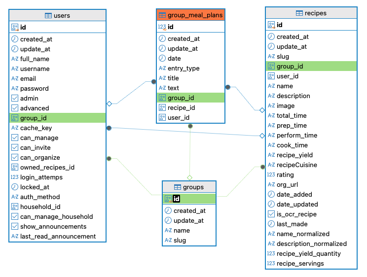

# KIM01: Kimball

Tässä harjoituksessa opit dimensionaalisen mallintamisen perusteet ja toteutat yksinkertaisen dimensionaalisen mallin Mealie-sovelluksen dataa käyttäen. Niin sanottu Kimball-mallinnus on yleinen dimensionaalisen mallinnuksen tapa tietovarastoissa. Tämä dimensiomallinnuksen tapa on nimetty Ralph Kimballin mukaan ja voit tutustua siihen hyvinkin kattavasti hänen kirjoittamassaan kirjassa [The Data Warehouse Toolkit: The Definitive Guide to Dimensional Modeling, 3rd Edition](https://learning.oreilly.com/library/view/the-data-warehouse/9781118530801/). Alkuperäisessä lähteessä esitellään mallinnusprosessi useiden eri esimerkkien kautta, mutta tässä harjoituksessa keskitytään hyvin yksinkertaiseen tapaukseen, jossa meillä on vain kahdenlaisia tauluja:

- **Faktataulu** (fact table), joka sisältää liiketoimintatapahtumia ja niiden mittareita.
- **Dimensiotaulut** (dimension tables), jotka sisältävät faktataulun mittareiden kontekstin, kuten esimerkiksi päivämäärän, tuotteen tai asiakkaan.

Faktataulussa yksi rivi on yksittäinen bisneksen kannalta merkittävä tapahtuma, kuten esimerkiksi ostotapahtuma. Faktataulussa on usein paljon rivejä, mutta vähän sarakkeita. Sarakkeet ovat usein joko dimensiotaulujen avaimia tai ==numeerisia faktoja==. Näitä faktoja, eli valitun granulariteetin mittalukuja (esimerkiksi määrä, hinta, aika sekunteina, kalorit), voi mieluiten summata yhteen merkittävällä tavalla. Toisin sanoen ne olisivat Johdatus koneoppimiseen -termein [Suhdeasteikollisia](https://sourander.github.io/ml-perusteet/1_koneoppiminen/datasetti/#suhdeasteikollinen) muuttujia. Tyypillinen esimerkki faktataulusta on myyntitapahtuma, joka on mallinnettu granulariteetiltaan yhdeksi kuittiriviksi (engl. line item) ostotapahtumasta, jossa on faktoina ostetun tuotteen hinta ja määrä. Esimerkiksi kaikki päivän ostotapahtumat voidaan luontevasti summata yhteen, jolloin saadaan päivän kokonaismyynti.

Dimensiotaulussa yksi rivi on yksittäinen bisneksen kannalta merkittävä entiteetti, kuten esimerkiksi asiakas, tuote tai päivämäärä. Dimensiotaulussa on usein vähän rivejä, mutta paljon sarakkeita. Sarakkeet ovat usein luonteeltaan kuvaavia, kuten esimerkiksi tuotteen nimi, tuotekategoria ja valmistaja.

Faktatauluja voi lopulta filtteröidä joinaamalla ne dimensiotaulun kanssa yhteen, käyttäen dimensiotaulun kuvaavia sarakkeita filttereinä, kuten `WHERE dim_product.product_name = 'Milk' AND dim_date.year = 2024`. Tällöin saadaan kaikki faktataulun rivit, jotka liittyvät maitoon ja vuoteen 2024.

Luomme seuraavan tietomallin:

```
fact_meal_plan
+-- dim_date
+-- dim_recipe
+-- dim_user
+-- dim_group
```

Faktataulun granulariteetti on yksi Mealie-sovellukseen tallennettu ateriasuunnitelmamerkintä.

Alkuperäiset taulut, joita tähän tarvitsemme, näkyvät kuvassa alla:



**Kuva 1:** _ER-kaavio Mealie-sovelluksen tietokannasta taulun `group_meal_plans` ympärillä. Taulun `group` sarake `id` on valittuna, jotta siihen viittaavat avaimet korostuvat vihreinä._

Käyttämämme data on Mealie-sovelluksen tietokannasta. Data on dumppi Parquet-muodossa; lataamme sen sisään käyttäen Marimo Notebookin SQL-soluja ja niiden käyttämää DuckDB-tietokantaa. Itse harjoitus koostuu varsinaisista SQL-lausekkeista, jotka muodostavat dimensiotaulut ja faktataulun. Lopuksi teemme muutaman kyselyn, joilla voimme tarkastella dataa.

!!! info "Datan luomiskertomus"

    Opettaja loi datan pikaisesti Mealie-sovelluksen avulla. Loin kymmenen käyttäjää ja naputtelin äkkiä UI:n avulla 20 reseptiä järjestelmään. Reseptit on generoinut M365 Copilot GPT-5.6 malli kehotteella, joka on muotoa:

    > "Using the proper JSON format (https://schema.org/Recipe), give me the recipe for lasagne. This is for Mealie App testing, so the recipe does not have to be realistic, but the JSON has to be correct. Give only the recipe in JSON code block. Nothing else."

    Palautunut JSON, jonka voi syöttää sovellukseen, näyttää tältä:

    ```json
    {
        "@context": "https://schema.org",
        "@type": "Recipe",
        "name": "Classic Lasagne",
        "description": "A simple layered lasagne with meat sauce, creamy béchamel, pasta sheets, and cheese.",
        "recipeCategory": "Main course",
        "recipeCuisine": "Italian",
        "keywords": "lasagne, pasta, Italian, beef, cheese",
        "recipeYield": "6 servings",
        "prepTime": "PT25M",
        "cookTime": "PT45M",
        "totalTime": "PT1H10M",
        "recipeIngredient": [
            "12 lasagne sheets",
            "500 g ground beef",
            // ... other ingredients omitted for brevity ...
            "50 g grated Parmesan cheese",
            "1 tablespoon olive oil"
        ],
        "recipeInstructions": [
            {
            "@type": "HowToStep",
            "name": "Prepare the meat sauce",
            "text": "Heat the olive oil in a large pan. Add the onion and garlic and cook until softened. Add the ground beef and cook until browned."
            },
            // ... other steps omitted for brevity ...
            {
            "@type": "HowToStep",
            "name": "Serve",
            "text": "Allow the lasagne to rest for 10 minutes before slicing and serving."
            }
        ]
    }
    ```

    Varsinainen faktataulun raakile (`group_meal_plans_ORIG.parquet`) on luotu Mealie-sovelluksen näkymässä **Meal Planner**. Tämän tekeminen 10 käyttäjälle olisi ollut melko työlästä, joten käytin apuna Pythonia ja `random`-kirjastoa. Näin on luotu tiedosto `group_meal_plans_MODIFIED.parquet`, johon viitataan alla. Jos tiedoston luonut skripti kiinnostaa, voidaan käsitellä tätä kurssin Teams-iltanuotioilla.

## Esivaatimukset

- uv (`uvx` CLI)
- Marimo Notebook (`marimo[recommended]`)

## Valmistelut

### Data

Lataa data valitsemaasi hakemistoon. Sinun tulee viitata tähän myöhemmin relatiivisella polulla, joten hyvä idea on sijoittaa se vaikka repositoriosi hakemistoon `kim01_kimball/data/`. Data on ladattavissa tämän Zensical-sivuston (eli kurssin) repositoriosta. Linkki repositorioon löytyy oikeasta yläkulmasta. Data löytyy polusta `gitlfs-store/gitlfs-store/kim01-data/**.parquet`. Voit ladata tiedostot GitHubin sivuilta klikkailemalla, vaikka ne ovatkin Git LFS:n avulla tallennettuja. Tarvitset seuraavat tiedostot:

- `group_meal_plans_MODIFIED.parquet`
- `groups.parquet`
- `recipes.parquet`
- `users.parquet`

Tiedosto `*_MODIFIED.parquet` on muokattu versio alkuperäisestä `*_ORIG.parquet`-tiedostosta. Dataa on generoitu käyttäjänimille `one`, `two`, ..., `ten` käyttäen sapluunana aitoa Mealie-sovelluksesta dumpattua dataa, joka kuului käyttäjälle `myself` ja joka on luotu käsin klikkailemalla.

### Notebook

Luo Marimo Notebook. Jos haluat päästä helpolla, ota käyttöön opettajan valmis tyhjä pohja, joka ei tee muuta kuin tulostaa DuckDB version.

```python
# /// script
# dependencies = [
#     "marimo[recommended]",
#     "pandas",
# ]
# requires-python = ">=3.14"
# ///

import marimo

__generated_with = "0.24.2"
app = marimo.App(width="medium")


@app.cell
def _():
    import marimo as mo

    return (mo,)


@app.cell(hide_code=True)
def _(mo):
    mo.md(r"""
    # KIM01: Kimball harjoitus
    """)
    return


@app.cell
def _(mo):
    _df = mo.sql(
        f"""
        PRAGMA VERSION
        """
    )
    return


if __name__ == "__main__":
    app.run()
```

Aja Notebook ylös näin:

```bash
uvx marimo edit --sandbox kim01_kimball.py
```

Tästä voit jatkaa eteenpäin harjoituksen tekemistä. Muista tallentaa Notebook säännöllisesti, jotta et menetä tekemääsi työtä.

## Tehtävänanto

### 1: Testaa datan lataus

Aloita varmistamalla, että saat dataa näkyville. Luo uusi SQL-solu ja kirjoita siihen seuraava SQL-lause:

```sql
SELECT *
FROM read_parquet(
	'path/to/your/group_meal_plans_MODIFIED.parquet'
);
```

Huomaa, että sinun tulee korvata `path/to/your/` sillä polulla, johon olet ladannut datan. Aja solu ja varmista, että se onnistuu ilman virheitä.

### 2: Luo näkymät raakadataan

Luo neljä näkymää (`groups`, `recipes`, `users`, `group_meal_plans`) vastaamaan ladattuja Parquet-tiedostoja. Käytä `CREATE VIEW` -lausetta ja varmista, että näkymät toimivat oikein. Ensimmäisen luonti hoituu näin, mutta joudut loput muotoilemaan itse:

```sql
CREATE OR REPLACE VIEW group_meal_plans AS
SELECT
    group_id::UUID AS group_id,
    recipe_id::UUID AS recipe_id,
    user_id::UUID AS user_id,
    * EXCLUDE (group_id, recipe_id, user_id)
FROM read_parquet(
    'path/to/your/group_meal_plans_MODIFIED.parquet'
);

-- CREATE OR REPLACE VIEW groups AS SELECT (...);
-- CREATE OR REPLACE VIEW recipes AS SELECT (...);
-- CREATE OR REPLACE VIEW users AS SELECT (...);
```

!!! info "Nimeä uusiksi"

    Nimeä kentät samalla uusiksi siten, että samaan asiaan viittaava id on aina sama. Eli siis `users.id` tulisi olla jatkossa `users.user_id` muotoa UUID. Sama koskee muiden taulujen id-kenttiä. Tämä helpottaa myöhemmin JOIN-lauseiden kirjoittamista, kun sama asia tunnetaan samalla nimellä.

??? info "Miksi CAST as UUID?"

    Parquet-tiedosto on luotu hakemalla PostgreSQL:stä dataa ja kirjoittamalla se suoraan Parquet-tiedostoon DuckDB:n avulla (`COPY mealie.group_meal_plans TO 'group_meal_plans.parquet' (FORMAT PARQUET);`). Tämä on säilyttänyt UUID:n loogisen tyypin, mutta Polarsilla dataa käsitellessä tyyppi on kadonnut. On kovin tyypillistä, että törmäät harvinaisempiin tietotyyppeihin siten, että ne eivät ole tuettuja ingestion-kerroksen kirjastoissa. Esimerkiksi Polarsin/Marimon DataFrame-näkymässä tällainen binääridata visualisoidaan merkkijonomaisessa muodossa. Tämän takia saatat nähdä esimerkiksi esityksen ` Ã¥ &Eí ÷Ó&RÀ`, vaikka lukisitkin alkuperäisen `_ORIG.parquet`-tiedosto, jossa metadata on kunnossa.

    Kaikissa tietovarastoissa UUID:lle ei ole omaa tietotyyppiä. Snowflakessa voidaan käyttää natiivia `UUID`-tietotyyppiä, mutta Databricks SQL:ssä ei tällä hetkellä ole vastaavaa yleistä natiivia UUID-tietotyyppiä. UUID voidaan tällöin säilyttää esimerkiksi binääridatana tai merkkijonona.
    Binäärinen UUID voidaan muuttaa esimerkiksi lausekkeella `lower(hex(group_id)) AS group_id` 32 heksadesimaalimerkin merkkijonoksi ilman väliviivoja. Alkuperäinen 16-tavuinen UUID sisältää 128 bittiä. Heksadesimaaliesityksen ASCII-merkit vievät UTF-8-koodauksessa yhden tavun eli 8 bittiä kukin, joten 32 merkin esitys tarvitsee 32 tavua eli 256 bittiä. Pakkaamattoman arvon esitys siis kaksinkertaistuu. Todellinen vaikutus tietovaraston käyttämään tallennustilaan riippuu kuitenkin muun muassa käytetystä tallennusmuodosta, encodingista ja pakkauksesta.

    Tämä on trade-off: binäärinen esitys on kompakti, kun taas merkkijonoesitys on ihmiselle helposti luettava ja sellaisenaan käsiteltävissä järjestelmissä, joissa UUID:lle ei ole omaa tietotyyppiä. Siitä, millä medaljonkiarkkitehtuurin kerroksella tällainen muunnos kannattaa tehdä, voi keskustella henkeviä alan asiantuntijoiden kanssa.


### 3: Määrittele liiketoimintaprosessi

Dimensionaalisen mallin suunnittelu aloitetaan määrittelemällä mallinnettava liiketoimintaprosessi. Tähän asti olemme vain kopioineet alkuperäisen kannan 3NF-muodossa olevat taulut toiseen tietokantaan. Nyt alkaa varsinainen tietomallinnus. Fakta- ja dimensiotaulut on esitelty jo yllä, mutta korostetaan vielä varmuuden vuoksi liiketoimintaprosessia erikseen: **Tässä harjoituksessa mallinnettava prosessi on ateriasuunnitelman ylläpitäminen Mealie-sovelluksessa.**

Lähdetaulu `group_meal_plans` ei sisällä numeerisia faktoja tai mittareita. Voisimme käyttää sitä sellaisenaan niin sanottuna _factless fact table_ -tyyppisenä faktatauluna, jolloin ateriasuunnitelmamerkintöjen määrä laskettaisiin faktataulun riveistä. Harjoittelemme kuitenkin tässä tehtävässä myös numeeristen faktojen muodostamista ja aggregointia. Tämän vuoksi rikastamme faktataulua `recipes`-taulusta saatavilla aikamittareilla sekä yhdellä kiinteäarvoisella laskurilla.

Käytettävät mittarit ovat:

- `prep_time_seconds` (reseptin valmisteluaika sekunteina)
- `perform_time_seconds` (reseptin suorittamisaika sekunteina)
- `total_time_seconds` (reseptin kokonaisaika sekunteina)
- `planned_meal_count` (ateriasuunnitelmamerkintöjen lukumäärää kuvaava mittari)

Faktataulun yksi rivi kuvaa yhtä ateriasuunnitelmamerkintää, joten planned_meal_count saa jokaisella faktarivillä arvon 1. Kenttää summaamalla voidaan laskea ateriasuunnitelmamerkintöjen määrä esimerkiksi käyttäjän, päivämäärän, reseptin tai ryhmän mukaan. Tämän kentän käytön ==voi korvata täysin== `COUNT(*)`-funktiolla, mutta kenttä on mukana harjoituksessa opetuksellisista syistä: havainnollistamassa granulariteettia ja mittareiden additiivisuutta. Harjoituksessa 9.1 tulet näkemään tavan käyttää tätä (`SUM(f.planned_meal_count) AS planned_meals`), joka täsmää myöhemmän harjoituksen 9.4 kanssa, jossa käytetään `COUNT(*) AS meal_count`. Molemmat tavat ovat oikein.

Varsinaista datan käsittelyä ja tietomallinnusta varten on hyvä huomioida, että lähdetaulun aikaa kuvaavat sarakkeet (esim. `total_time`) ovat merkkijonoja, jotka on esitetty muodossa `PT1H10M` (1 tunti 10 minuuttia). Tämä on ISO 8601 -standardin mukainen aikaformaatti; lue [Wikipediasta: ISO 8601](https://en.wikipedia.org/wiki/ISO_8601) lisää. Meidän tulee muuntaa nämä merkkijonot sekunneiksi, jotta voimme tehdä niillä laskutoimituksia.

!!! tip

    DuckDB tukee `INTERVAL`-tyyppisiä arvoja, mutta me muutamme ne `INT` sekunneiksi. Syy on helpompi loppukäyttö. Esimerkiksi BI-työkalut eivät välttämättä osaa käsitellä `INTERVAL`-tyyppisiä arvoja, mutta mikä tahansa maailman sovellus ymmärtää kokonaisluvut.

### 4: Mallinna faktataulu

Aloitetaan luomalla faktataulu, koska aika-arvojen parsiminen tulee todennäköisesti olevaan haastavin asia tämän datan muotoilussa. Voisimme parsia ajat monella tavalla, kuten käyttäen `regexp()`-funktiota, mutta opettajan kokeilulla `TRY_CAST` näyttää ymmärtämän ihmisluettavan ISO 8601 vastineen oikein. Tämä siis toimii:

```sql
CREATE OR REPLACE VIEW recipes_timefixed AS
SELECT
    recipe_id,
    group_id,
    user_id,
    EPOCH(TRY_CAST(prep_time AS INTERVAL))::BIGINT AS prep_time_seconds,
    -- Opiskelija: muunna perform_time sekunneiksi tässä
    -- Opiskelija: muunna total_time sekunneiksi tässä
    * EXCLUDE (recipe_id, group_id, user_id, prep_time, perform_time, total_time)
FROM recipes;
```

!!! tip

    Näin monen VIEW:n luominen ei tuotannossa kannattaisi; parempi olisi käyttää esimerkiksi WITH-lauseketta eli CTE:tä (Common Table Expression). Käytämme kuitenkin VIEW:tä sinun elämäsi helpottamiseksi. CTE:n sisältöä on todella, todella vaikea katselmoida. VIEW:n sisällön tarkastelu on sen sijaan täysin triviaali `SELECT * FROM recipes_timefixed`.

    Voisimme myös käyttää `...REPLACE TEMPORARY VIEW...`, jolloin se ei tallennu kantaa, mutta meidän kantapa on in-memory DuckDB, joten sillä ei ole mitään merkitystä.

Nyt voimme muodostaa varsinaisen faktataulun, jota varten meidän tulee joinata `group_meal_plans`-taulu `recipes_timefixed`-tauluun. Tauluun tulee vierasavaimet (_date_key, recipe_id, user_id, group_id_) sekä faktat (_prep_time_seconds, perform_time_seconds, total_time_seconds, planned_meal_count_) ja kiinteällä arvolla 1 varustettu mittari `planned_meal_count`. Tämä on selitetty yllä, miksi se on aina 1.

```sql
CREATE OR REPLACE VIEW fact_meal_plan AS
SELECT
    gmp.date AS date_key,
    recipe_id,
    gmp.user_id,
    gmp.group_id,
    r.prep_time_seconds,
    r.perform_time_seconds,
    r.total_time_seconds,
    -- Opiskelija: lisää tähän planned_meal_count sarake
FROM group_meal_plans gmp
LEFT JOIN opiskelija_kirjoita_tahan_puuttuva_relaation_nimi r USING (recipe_id);
```

!!! info "Faktataulun avain"

    Faktataululla ei tässä tapauksessa ole yhtä yksittäistä saraketta, joka toimisi selkeänä luonnollisena avaimena. Yksilöivä avain voidaan muodostaa useamman sarakkeen yhdistelmästä. Tästä yhdistelmästä voitaisiin muodostaa esimerkiksi surrogaattiavain kuvitteellisella funktiolla `generate_surrogate_key()`. Surrogaattiavaimista voit lukea lisää vaikka [dbt blog: Guide to surrogate keys](https://www.getdbt.com/blog/guide-to-surrogate-key).

    Jos avaimen muodostavat esimerkiksi sarakkeet `field_a`, `field_b` ja `field_c`, ajatus voisi näyttää yksinkertaistettuna tältä:

    ```sql
    SELECT
        MD5(
            CONCAT_WS(
                '||',
                COALESCE(field_a::VARCHAR, 'Missing'),
                COALESCE(field_b::VARCHAR, 'Missing'),
                COALESCE(field_c::VARCHAR, 'Missing')
            )
        ) AS surrogate_key
    FROM table_name;
    ```

    Tällaista avainta voidaan käyttää muun muassa faktataulun laadun tarkastamiseen: saman avaimen ei pitäisi esiintyä faktataulussa useita kertoja. Jos duplikaatteja löytyy, kannattaa tarkistaa, vastaavatko avaimeen valitut kentät todella faktataululle määriteltyä granulariteettia.

    En paljasta, mitkä kentät muodostavat tämän faktataulun yksilöivän yhdistelmän. Tätä kysytään myöhemmin **Videolla esitettävä** -osassa.

### 5: Mallinna resepti

```sql
CREATE OR REPLACE VIEW dim_recipe AS
SELECT
    recipe_id,
    name as recipe_name,
    recipe_servings
FROM recipes;
```

### 6: Mallinna käyttäjä

```sql
CREATE OR REPLACE VIEW dim_user AS
SELECT
    user_id,
    "username" AS mealie_user,
    created_at::DATE AS registration_date
FROM users;
```

### 7: Mallinna ryhmä

```sql
CREATE OR REPLACE VIEW dim_group AS
SELECT
   -- Opiskelija: lisää tähän group_id sarake
   -- Opiskelija: lisää tähän group_name sarake
FROM groups;
```

### 8: Mallinna päivämäärä

```sql
CREATE OR REPLACE VIEW dim_date AS
SELECT DISTINCT
    date_key,
    YEAR(date_key) AS year,
    MONTH(date_key) AS month,
    -- Opiskelija: lisää päivän numero sarakkeeseen day

    (
        MONTH(date_key) = 12
        AND DAY(date_key) IN (24, 25)
    ) AS is_xmas_time,

    DAYOFWEEK(date_key) IN (0, 6) AS is_weekend

FROM fact_meal_plan;
```

!!! warning

    Päivämäärädimensio rakennetaan usein kalenterista vuosikymmeniksi eteenpäin. Tässä harjoituksessa riittää muodostaa se faktataulussa esiintyvistä päivämääristä.

### 9: Analysoi dataa

Voila! Nyt sinulla on valmis dimensiomalli, jota voit käyttää analysointiin. Ei tämä ehkä vielä maailmaa mullistava tietovarasto ole, mutta tästä on helppo alkaa skaalata ylöspäin. Jotta koko mallinnuksessa olisi ollut järkeä, niin tehdään lopuksi pari visualisointia. Koska tämä ei ole kurssi visualisoinnista, annan valmiit SQL-lausekkeet ja kerron, mitä sinun tulee valita Marimo Notebookin DataFrame-näkymän Visualize-välilehdellä.

Luonnollisesti alla olevien lisäksi kyselyitä saa keksiä myös itse, jos visualisointi on lähellä sydäntäsi.

#### 9.1: Kuka eniten?

**Kysymys:** Kuinka monta ateriaa kukin käyttäjä on suunnitellut?

```sql
SELECT
    u.mealie_user,
    SUM(f.planned_meal_count) AS planned_meals
FROM fact_meal_plan f
JOIN dim_user u
    ON f.user_id = u.user_id
GROUP BY u.mealie_user
ORDER BY planned_meals DESC;
```

Visuaalisaatiosta valitset:

- Chart type: Bar Chart
- X-axis: mealie_user (agg: None)
- Y-axis: planned_meals (agg: None)

#### 9.2: Valmisteluaika

**Kysymys:** Kuinka paljon valmisteluaikaa kuhunkin reseptiin on käytetty yhteensä?

```sql
SELECT
    r.recipe_name,
    SUM(f.prep_time_seconds) AS total_prep_seconds
FROM fact_meal_plan f
LEFT JOIN dim_recipe r USING (recipe_id)
GROUP BY r.recipe_name
ORDER BY total_prep_seconds DESC;
```

Visuaalisaatiosta valitset:

- Chart type: Bar Chart
- X-axis: recipe_name (agg: None)
- Y-axis: total_prep_seconds (agg: None)

#### 9.3: Arki vs. Viikonloppu

**Kysymys:** Kuinka paljon aterioita on suunniteltu arkipäiville vs. viikonlopulle?

```sql
SELECT
    d.is_weekend,
    SUM(f.planned_meal_count) AS planned_meals
FROM fact_meal_plan f
JOIN dim_date d USING (date_key)
GROUP BY d.is_weekend;
```

Visuaalisaatiosta valitset:

- Chart type: Pie Chart
- Color by: is_weekend (data type: Categorical)
- Size by: planned_meals (agg: None)

!!! tip

    Olisikohan tämä mahdollisesti kannattavaa painottaa arjen/viikonlopun yleisyyden mukaan? Jos haluat kokeilla, niin:

    ```sql
    CASE 
        WHEN d.is_weekend THEN SUM(f.planned_meal_count) / 2
        ELSE SUM(f.planned_meal_count) / 5
    END AS planned_meals_weighted
    ```

#### 9.4: Arjen suosikit

**Kysymys:** Mitkä ovat kunkin käyttäjän suosituimmat reseptit arkisin? Kukahan käyttäjistä mahtaa syödä pannukakkuja päivästä toiseen.

```sql
SELECT
    u.mealie_user,
    r.recipe_name,
    COUNT(*) AS meal_count
FROM fact_meal_plan f
JOIN dim_user u
    ON f.user_id = u.user_id
JOIN dim_recipe r USING (recipe_id)
JOIN dim_date d USING (date_key)
WHERE NOT d.is_weekend
GROUP BY
    u.mealie_user,
    r.recipe_name;
```

Visuaalisaatiosta valitset:

- Chart type: Bar Chart
- X-axis: mealie_user (agg: None)
- Y-axis: meal_count (agg: None)
- Color by: recipe_name (agg: None)
    - (x) Stacked

!!! warning

    Oikean datan kanssa et todellakaan koskaan asettaisi käyttäjänimeä x-akselille, koska käyttäjiä on tuhansittain tai miljoonittain. Todennäköisesti vastaavassa kuvaajassa x-akselilla olisi esimerkiksi jokin käyttäjäsegmentti.

## Videolla esitettävä

1. Kerrot, kuinka monta tuntia käytit harjoitukseen. 
2. Selität omin sanoin lyhyesti, mikä on dimensionaalisessa mallissa faktataulun ja dimensiotaulun ero. 
3. Näytät Marimo Notebookista luomasi neljä raakadataan osoittavaa näkymää (`group_meal_plans`, `groups`, `recipes` ja `users`) ja avaat vähintään yhden niistä niin, että dataa näkyy.
4. Näytät `recipes_timefixed`-näkymästä, että reseptien ISO 8601 -muotoiset aika-arvot on muunnettu sekunneiksi. Selität lyhyesti, miksi muunnos tehdään.
5. Näytät `fact_meal_plan`-faktataulun sisällön ja kerrot, mikä yhden rivin granulariteetti tässä faktataulussa on.
6. Selitä, mitkä `fact_meal_plan`-taulun sarakkeet muodostaisivat komposiittina primääriavaimen, jos sellainen olisi määritelty (esim. `generate_surrogate_key()`-funktiolla).
7. Osoitat faktataulusta vähintään yhden dimension vierasavaimen ja yhden numeerisen faktan/mittarin.
8. Näytät vähintään kaksi tekemääsi dimensiotaulua ja kerrot, mitä kuvailevaa tietoa niissä säilytetään.
9. Näytät `dim_date`-taulusta, miten päivämäärästä on muodostettu uusia kuvailevia ominaisuuksia, kuten `year`, `month` tai `is_weekend`.
10. Suoritat vähintään yhden kohdan 9 analyysikyselyistä ja näytät sen tulokset visualisointeina.
