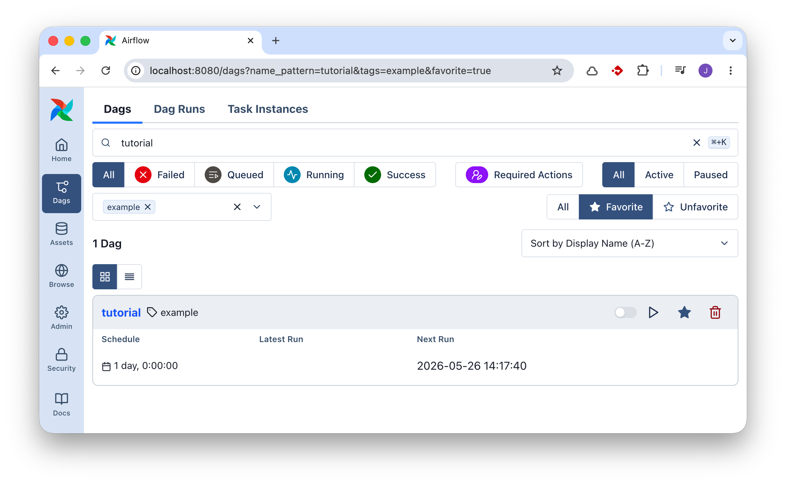
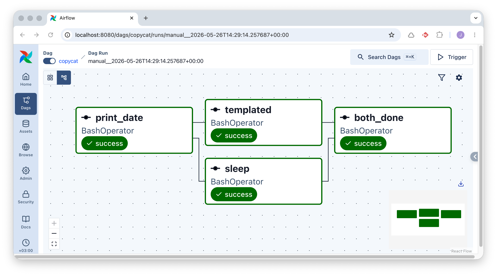
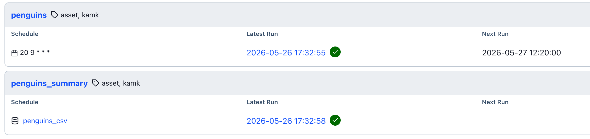

# ORC01: Apache Airflow

Apache Airflow on työnkulkujen orkestrointityökalu. Siinä työnkulku kuvataan DAGina (Directed Acyclic Graph): joukko tehtäviä (*task*), niiden väliset riippuvuudet ja ajastussääntö. Airflow'n Scheduler tunnistaa, milloin DAG on aika suorittaa, jonottaa tehtävät ja antaa ne Executor-prosessin suoritettavaksi. Web UI näyttää työnkulkujen tilan reaaliajassa ja tarjoaa käyttöliittymän manuaaliseen käynnistämiseen sekä lokien selaamiseen.

Tässä harjoituksessa ajetaan Airflow'ta paikallisesti Docker Composessa.

Voit tutustua myös [Airflow 101: Building Your First Workflow](https://airflow.apache.org/docs/apache-airflow/stable/tutorial/fundamentals.html)-tutoriaaliin, joka on tämän harjoituksen pohjaesimerkki ja lähtökohta. Tämä on yksinkertaistettu versio samasta. Tutustu myös [Quick Start](https://airflow.apache.org/docs/apache-airflow/stable/start.html)-ohjeeseen. Dockeriin liittyvä ohjeistus löytyy [Running Airflow in Docker](https://airflow.apache.org/docs/apache-airflow/stable/howto/docker-compose/index.html)-sivulta.

## Esivaatimukset

- Docker ja Docker Compose

## Valmistelut: Airflow-ympäristö

### Lataa Docker Compose -tiedosto

Luo hakemisto harjoitustasi varten, esimerkiksi `airflow-harjoitus/`. Luo sinne alihakemistot `dags/` ja `data/`. Lisää hakemistoon `docker-compose.yaml` (tai sama tiedosto tuoreemmalla `compose.yaml` nimellä). Tiedsoton sisältö on niin pitkä, etten listaa sitä alla kokonaisuudessaan. Lataa tiedosto alla olevalla komennolla, jos sinulla `curl` tai `wget` asennettuna:

```bash
# curl
curl -LfO 'https://airflow.apache.org/docs/apache-airflow/3.2.1/docker-compose.yaml'

# ...tai wget
wget 'https://airflow.apache.org/docs/apache-airflow/3.2.1/docker-compose.yaml'
```

Jos sinulla ei ole jostain syystä kumpaakaan, voit ladata selaimella navigoimalla yllä olevaan URL:iin. Korostan, että on suositeltavaa silmäillä sivussa Airflow:n omaa, virallista dokumentaatiota, jonka pohjalta tämä harjoitus on rakennettu. Se löytyy osoitteesta [Running Airflow in Docker](https://airflow.apache.org/docs/apache-airflow/stable/howto/docker-compose/index.html).


### Initialisoi konfiguraatio

Älä aja sokkona `docker compose up` -komentoa, vaan noudata ohjeistusta ja aja ensin initilisointi. Tarkat ohjeet löytyy Airflow:n dokumentaatiosta, mutta alla on TLDR:

```bash
# Jos sinulla on Linux, aja:
mkdir -p ./dags ./logs ./plugins ./config
echo -e "AIRFLOW_UID=$(id -u)" > .env

# Jos sinulla on jokin muu OS, voit luoda tyhjän .env-tiedoston, jotta ei tule herjoja
touch .env

# Ja sitten:
docker compose run airflow-cli airflow config list
```

Suosittelen lämpimästi tässä välissä silmäilemään `docker-compose.yaml`-tiedoston sisältöä. Tutustu pintapuoleisesti eri palveluihin ja eri bind mountteihin.

### Initialisoi tietokanta

Tämä ohje pätee kaikkiin käyttöjärjestelmiin:

```bash
# Tämä ajetaan tasan kerran. Se luo PostgreSQL-tietokannan ja käyttäjätiedot, 
# joita Airflow käyttää metatietokantanaan.
docker compose up airflow-init
```

### Aja palvelu ylös

```bash
# Flägi -d on valinnainen; voit ajaa sen myös suoraan etualalla, 
# nähden kaikki lokit ja välivaiheet ilman lisäkomentoja.
docker compose up -d
```

Odota, että palvelu on ylhäällä, ja testaa se:

1. Avaa selaimella `localhost:8080`. Näet Airflow'n Web UI:n.
2. Kirjaudu sisään: `airflow / airflow` (käyttäjätunnus / salasana).

## Tehtävänanto

### 1: Seuraa tutoriaalia

Kun jollakin kirjastolla on kattava tutorials/examples-osio, ei kannata lähteä merta edemmäs kalaan, vaan penkoa valmiita esimerkkejä. Tämän kurssin puitteissa riittää, että avaat [Airflow 101: Building Your First Workflow](https://airflow.apache.org/docs/apache-airflow/stable/tutorial/fundamentals.html)-tutoriaalin ja tutustut sen sisältöön. Huomaat kyseisen DAG:n Details-välilehdeltä, että se on lokaatiossa `/home/airflow/.local/lib/python3.13/site-packages/airflow/example_dags/tutorial.py` kontin sisällä. Tämä on eri lokaatio kuin sinun `dags/`-hakemistosi, joka on kontin sisällä `/opt/airflow/dags`.



**Kuva 1:** *Airflow:n tagilla `example` varustettu DAG nimeltään `tutorial` on hyvä paikka aloittaa. Kuvassa se on ainut näkyvä, koska olen klikannut siitä tähdellä suosikin, ja filtteröinyt vain tähdellä varustetut DAG:t.*

### 2: Kopioi esimerkki ja tee siitä oma

Tällä tehtävällä varmistat, että `dags/`-hakemiston sijainti päätyy Airflow:n huomaamaksi. Kopioi edellisen kohdan tutoriaalista tiedoston sisältö ja tallenna se `dags/`-hakemistoon nimellä `copycat.py`. Tee tiedostoon seuraava muutos: muuta DAG:n `dag_id`-arvo `copycat`-nimiseksi. Tämä on vaatimus, koska ==DAG ID:n tulee olla uniikki==. Halutessasi voit myös lisätä oman tagin, jolla löydät DAG:n helpommin Web UI:sta.

```python title="copycat.py"
from airflow.sdk import DAG
with DAG(
    "copycat",                # <-- Muuta tämä!
    #...,
    tags=["example", "kamk"], # <-- Lisää oma tagi!
)
```

### 3: Löydä ja aktivoi copycat

Jos menet DAG-näkymään Web UI:hin, todennäköisesti huomaat, että `copycat`-DAG ei ilmesty välittömästi listaan. Tämä johtuu `airflow.cfg`-tiedoston asetuksista:

```ini title="airflow.cfg"
[dag_processor]
refresh_interval = 300
```

Jos haluat nopeuttaa tätä prosessia, voit käyttää CLI-komentoja. Koska ajat kokonaisuutta Docker Composessa, sinun tulee ajaa komennot näin:

```bash
# docker compose exec airflow-worker airflow <komento> [--optionit]
docker compose exec airflow-worker airflow info
```

Voit pakottaa DAG:n uudelleenlatauksen komennolla:

```bash
docker compose exec airflow-worker airflow dags reserialize
```

Kunhan saat DAG:n ilmestymään listaan, aktivoi se painamalla toggle-painiketta.

### 4: Tutustu CLI-komentoihin

Yllä mainitun tutoriaalin lopussaa on pari esimerkkikomentoa. Kokeile ajaa ne, mutta vaihta `tutorial`-nimi `copycat`-nimiseksi, ja kääri koko komento `docker compose exec airflow-worker` -komennon sisään. Esimerkiksi:

```bash
# Referenssi: airflow tasks list tutorial
docker compose exec airflow-worker airflow tasks list copycat

# Referenssi: airflow tasks test tutorial print_date 2015-06-01
docker compose exec airflow-worker airflow tasks test copycat print_date 2026-06-01
```

!!! tip

    Huomaat, että output tulostuu ruudulle, mutta ei pääty `logs/`-hakemiston tiedostoihin. Tämä on `test`-komennon ominaisuus.

### 5: Aja DAG Web UI:sta

Aja DAG myös Web UI:sta. Tarkkaile, kuinka tehtävät etenevät `success`-tilaan. Etsi loki sekä graafisesta käyttöliittymästä että `logs/`-hakemistosta.

### 6: Aja backfill ja tutki kalenteria

Kokeile ajaa myös backfill. Se onnistuu helpoiten CLI:stä näin:

```bash
docker compose exec airflow-worker airflow backfill create --dag-id copycat --from-date 2026-05-01 --to-date 2026-05-07
```

Jos käyt Web UI:ssa DAG:n Calendar-välilehdellä, näet, että toukokuun alussa on useita vihreitä päiviä, jotka edustavat onnistuneita ajosuorituksia. Huomaat myös, että huomisesta alkaen on harmaataustaisia päiviä. Tämä johtuu siitä, että DAG on määritetty ajettavaksi päivittäin: `schedule=timedelta(days=1)`.

!!! tip

    Backfill on hyödyllinen, kun esimerkiksi lähdejärjestelmässä on ollut häiriö, ja olet noutanut väärää dataa. Tämä toki vaatii, että DAG on idempotentti, eli sen voi ajaa uudestaan ilman haittavaikutuksia, ja että kohdejärjestelmä tulee uusien tietojen kanssa toimeen.


### 7: Lisää t4

Aiemmin käytetyssä `copycat`-DAG:ssa on kolme taskia, joiden DAG on määritelty näin: `t1 >> [t2, t3]`. Lisää uusi task `t4`, joka suoritetaan vasta, kun sekä `t2` että `t3` ovat onnistuneet. Alla kuvassa on esimerkki siitä, miltä DAG:n pitäisi näyttää.



**Kuva 2:** *DAG, jossa t1 on riippumaton, t2 ja t3 riippuvat t1:stä, ja t4 riippuu sekä t2:sta että t3:sta. Taskille t4 on annettu ID "both_done"*

### 8: Tee dataa prosessoiva DAG

!!! warning

    Tähän väliin on pakko varoittaa, että Airflow’n task-runneria ei yleensä ole tarkoitettu raskaiden dataoperaatioiden ajamiseen. Airflow’n ensisijainen rooli on orkestroida työnkulkuja: päättää mitä ajetaan, milloin ajetaan, missä järjestyksessä tehtävät suoritetaan ja miten virheistä toivutaan.

    Taskit voivat toki sisältää Python-koodia, SQL-kyselyitä tai shell-komentoja, mutta tuotantoympäristössä raskas laskenta tai suuri datan prosessointi kannattaa yleensä delegoida ulkoiseen järjestelmään. Esimerkiksi SQL-tehtävä voi käynnistää työn tietokannassa, shell-komento voi kutsua Spark-jobia, ja Python-task voi tehdä API-kutsun erilliseen palveluun. Tavallista on käyttää REST API:a tai valmista provideria (ks. [Providers](https://airflow.apache.org/registry/providers/)), jolla Airflow käskyttää erillistä data-alustaa, tietokantaa tai muuta järjestelmää, kuten Databricksiä, Snowflakea, BigQueryä tai Spark-klusteria.

    Airflow 3:n Asset-konsepti (aiemmin Datasets) ei tarkoita, että Airflow toimisi varsinaisena datavarastona. Asset on looginen kuvaus dataresurssista, kuten tiedostosta, taulusta tai objektivaraston polusta. Sen avulla voidaan mallintaa DAGien välisiä riippuvuuksia ja käynnistää työnkulkuja, kun jokin dataresurssi päivittyy. Itse data kannattaa säilyttää tarkoitukseen sopivassa järjestelmässä, kuten tietokannassa, data warehousessa, data lakessa tai objektivarastossa. Assets-esimerkeissä viitataankin S3-buckettiin: tämä olisi parempi tapa kuin lokaali tiedosto. Lokaalin tiedoston käyttö on harjoituksellisista syistä helppoa ja siksi käytössä.


Luo DAG, jonka nimi on esimerkiksi `dags/penguins.py`. Koodin kirjoittaminen veisi huomiota itse data-alustoista, joten se on tarjottuna alla valmiiksi.

```python title="penguins.py"
import importlib.util
import logging
from datetime import datetime, timedelta

from airflow.sdk import Asset, DAG, task


log = logging.getLogger(__name__)

PENGUINS_SOURCE_URL = "https://raw.githubusercontent.com/mwaskom/seaborn-data/master/penguins.csv"
PENGUINS_OUTPUT_PATH = "/opt/airflow/data/penguins.csv"
PENGUINS_ASSET = Asset(
    uri=f"file://{PENGUINS_OUTPUT_PATH}",
    name="penguins_csv",
)


def is_venv_installed() -> bool:
    return importlib.util.find_spec("virtualenv") is not None


def _process_penguins(csv_url: str, output_path: str) -> str:
    import pandas as pd
    from pathlib import Path
    
    dataframe = pd.read_csv(csv_url)
    dataframe["body_mass_kg"] = (dataframe["body_mass_g"] / 1000).round(3)

    preview = dataframe.head(10)
    print("Palmer Penguins preview:")
    print(preview.to_string(index=False))

    output_file = Path(output_path)
    output_file.parent.mkdir(parents=True, exist_ok=True)
    dataframe.to_csv(output_file, index=False)

    print(f"Stored {len(dataframe)} rows in {output_file}")
    return str(output_file)


@task(task_id="virtualenv_missing")
def virtualenv_missing() -> None:
    raise RuntimeError(
        "The penguins DAG needs virtualenv so it can install pandas for @task.virtualenv. "
        "Install virtualenv in the Airflow environment and refresh the DAG."
    )


if is_venv_installed():
    process_penguins = task.virtualenv(
        task_id="process_penguins",
        requirements=["pandas"],
        system_site_packages=False,
        outlets=[PENGUINS_ASSET],
    )(_process_penguins)
else:
    process_penguins = None


with DAG(
    "penguins",
    default_args={
        "depends_on_past": False,
        "retries": 1,
        "retry_delay": timedelta(minutes=1),
    },
    schedule="20 9 * * *",
    start_date=datetime(2026, 1, 1),
    catchup=False,
    tags=["asset", "kamk"],
) as dag:
    if process_penguins is None:
        log.warning(
            "virtualenv is not installed, so the penguins task cannot create its pandas environment."
        )
        virtualenv_missing()
    else:
        process_penguins(
            csv_url=PENGUINS_SOURCE_URL,
            output_path=PENGUINS_OUTPUT_PATH,
        )
```

!!! tip

    Voit testata sen tässä välissä CLI:stä, jos haluat:

    ```
    docker compose exec airflow-worker airflow dags test penguins 2026-06-01
    ```

Lopuksi käy ajamassa se Web UI:sta, ja varmista, että kaikki taskit onnistuvat. Tutki lokitiedot. Siellä pitäisi näkyä 10 riviä Penguins-dataa tulostettuna. Lisäksi tiedoston pitäisi löytyä **Assets**-välilehdeltä, ja sen rivimäärän voi laskea esimerkiksi näin:

```bash
docker compose exec airflow-worker wc -l /opt/airflow/data/penguins.csv
# Output: 345 /opt/airflow/data/penguins.csv
```

### 9: Käsittele luotua Assettia

Luo vielä toinen DAG, jonka trigger on yllä luotu Asset. Tarkoitus on, että se ajetaan aina, kun kyseistä assettia päivitetään edellisen (tai jonkin muun) DAG:n toimesta. Koodi on valmiiksi annettuna alla:

```python title="penguins_summary.py"
from datetime import datetime
from airflow.sdk import Asset, DAG, task

PENGUINS_ASSET = Asset(
    uri="file:///opt/airflow/data/penguins.csv",
    name="penguins_csv",
)

with DAG(
    "penguins_summary",
    schedule=[PENGUINS_ASSET],
    start_date=datetime(2026, 1, 1),
    catchup=False,
    tags=["asset", "kamk"],
) as dag:

    @task
    def summarize_penguins():
        import pandas as pd

        df = pd.read_csv("/opt/airflow/data/penguins.csv")
        print(df.groupby("species")["body_mass_kg"].mean())

    summarize_penguins()
```



**Kuva 3:** *Dags-näkymässä on huomattavissa, että `penguins_summary`-DAG:lla on triggerinä `penguins_csv`-assetti, ja sen latest run on pari sekuntia `penguins`:n, joka käynnistettiin manuaalisesti, jälkeen.*

## Videolla esitettävä

!!! warning

    Tämä lista on WORK IN PROGRESS. Tarkista se.

Tässä harjoituksessa videon tulee osoittaa vähintään seuraavat asiat:

1. Kerrot, kuinka monta tuntia käytit harjoitukseen.
2. Selität lyhyesti, mikä on Apache Airflow ja mikä on DAGin rooli (yleisönä toisen tiimin jäsen, ei datainsinööri).
3. Käynnistät Docker Compose -palvelun videolla (`docker compose up -d`) tai osoitat, että se on jo käynnissä.
4. Avaat Web UI:n (`localhost:8080`) ja näytät, mistä `copycat`-DAG löytyy.
5. Ajat DAGin manuaalisesti ja näytät Graph-näkymästä, kuinka taskit etenevät `success`-tilaan (mukaan lukien `t4`).
6. Avaat yhden taskin lokitiedot Web UI:sta ja esität, mitä se teki.
7. Esittelet, kuinka `penguins` ja `penguins_summary`-DAG:t hyödyntävät Assettia, ja kuinka `penguins_summary`-DAG käynnistyy, kun `penguins`-DAG päivittää assetin.
