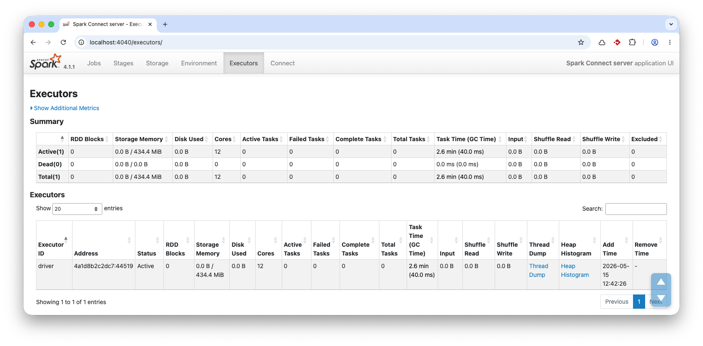

# SRK01: Apache Spark

Apache Spark on suurten data-aineistojen käsittelyyn tarkoitettu analytiikkamoottori, jota voi käyttää esimerkiksi Pythonilla, Scalalla, Javalla, SQL:llä ja R:llä. Tässä harjoituksessa Sparkia käytetään PySparkilla eli Python-rajapinnan kautta.

PySpark välittää operaatiot Pythonista Sparkille, jonka ydinsuoritus tapahtuu JVM-pohjaisessa Spark-moottorissa. Kun käytetään Spark SQL:ää tai DataFrame API:a, suorituskyky on lähtökohtaisesti sama. Ei ole siis väliä, käytätkö SQL-kyselyitä, R-kieltä, Scalaa vai Pythonia – jos unohdetaan tietyt poikkeukset kuten UDF:t (User Defined Functions).

PySpark DataFrame API:ssa on samoja DataFrame-ajattelun piirteitä kuin Pandasissa ja Polarsissa, mutta suoritusmalli on erilainen. Spark on suunniteltu ==hajautettuun käsittelyyn==: data jaetaan osituksiin, joita voidaan käsitellä rinnakkain useilla suorittajilla. 

Pandas alkaa usein olla hankala, kun data ei mahdu mukavasti yhden koneen muistiin. Polars ja DuckDB pystyvät käsittelemään huomattavasti suurempia aineistoja yhden koneen ympäristössä, myös osittain muistia suurempia työkuormia. Spark on perusteltu valinta, kun tarvitaan klusterin laskentatehoa, muistia, fault tolerancea tai integroitumista hajautettuun data-alustaan. Sparkia voi silti ajaa myös paikallisesti yhdellä koneella, mikä sopii hyvin opetukseen ja kokeiluun. Ja näin me teemme tässä harjoituksessa.

!!! warning "Odotukset aisoihin"

    Yhden koneen moodissa Spark ei ole nopein vaihtoehto. Hajautettu suoritusmalli tuo overheadiä. Tällöin esimerkiksi Polars tai DuckDB voittavat benchmarkin yleensä melko suurilla marginaaleilla. Sparkin on oikeutettu valinta silloin, kun data, laskenta tai I/O kannattaa jakaa useille koneille eli datasetti on valtava. Mikään *autopilot* Apache Spark ei ole silloinkaan. Spark skaalautuu erityisen hyvin töissä, joissa data voidaan käsitellä rinnakkain vähäisellä datan siirtelyllä (eli *narrow transformations*). Wide-operaatiot, kuten `JOIN`, `GROUP BY` ja `ORDER BY`, voivat aiheuttaa shufflea eli datan uudelleenjakoa solmujen välillä. Tällöin verkosta tulee pullonkaula.
    
    Nämä operaatiot eivät ole kiellettyjä tai automaattisesti hitaita, mutta niiden suorituskyky vaatii huolellista suunnittelua esimerkiksi partitioinnin osalta. Käytännössä tämä ajaa siihen, että loppukäyttäjälle tarkoitetun taulun tietomallian *one big table* on yllättävän tehokas, kun taas rankasti normalisoitu tietomalli aiheuttaa helposti suorituskykyongelmia.


Tässä harjoituksessa käytetään yhtä Spark-instanssia, jota ajetaan Docker Compose -projektissa. Lokaalissa host-koneessa käytämme Marimo Notebookia, joka kutsuu tuota instanssia. Jos haluat nähdä toteutuksesta kuvaajia, kannattaa vilkaista esimerkiksi Sanjeet Shuklan kirjoitus [Medium: Setting Up Apache Spark from Scratch in a Docker Container: A Step-by-Step Guide](https://medium.com/@sanjeets1900/setting-up-apache-spark-from-scratch-in-a-docker-container-a-step-by-step-guide-2c009c98f2a7). Erona on se, että me ajamme lokaalin clientin `uvx marimo edit --sandbox <notebook>`-komennolla, emmekä aja kontin sisällä Jupyter Notebookia. Näin ero clientin ja hostin välillä on selkeämpi.

## Esivaatimukset

- Docker ja Docker Compose
- Marimo Notebook (`marimo[recommended]`).

## Valmistelut: Spark Instance

Luo hakemisto harjoitustasi varten, esimerkiksi `spark-harjoitus/`. Lisää sinne alla oleva `compose.yaml`:

```yaml
services:
  spark-connect:
    image: spark:4.1.1-scala2.13-java17-python3-ubuntu
    container_name: srk01-spark-connect
    user: root
    ports:
      - "15002:15002"
      - "4040:4040"
    volumes:
      - spark-lake:/lake
      - ./bootstrap.sh:/bootstrap.sh:ro
    working_dir: /lake
    command: ["/bin/bash", "/bootstrap.sh"]

volumes:
  spark-lake:
```

Lisää myös `bootstrap.sh`-tiedosto samaan hakemistoon:

```bash
#!/usr/bin/env bash
set -euo pipefail

mkdir -p /lake/warehouse
mkdir -p /lake/metastore
mkdir -p /tmp/spark-local
mkdir -p /opt/spark/logs

chown -R spark:spark /lake /tmp/spark-local /opt/spark/logs

su spark -s /bin/bash -c '
/opt/spark/sbin/start-connect-server.sh \
  --master local[*] \
  --conf spark.connect.grpc.binding.address=0.0.0.0 \
  --conf spark.connect.grpc.binding.port=15002 \
  --conf spark.sql.warehouse.dir=/lake/warehouse \
  --conf spark.sql.catalogImplementation=hive \
  --conf "spark.hadoop.javax.jdo.option.ConnectionURL=jdbc:derby:/lake/metastore/metastore_db;create=true" \
  --conf spark.hadoop.javax.jdo.option.ConnectionDriverName=org.apache.derby.jdbc.EmbeddedDriver \
  --conf spark.local.dir=/tmp/spark-local
'

tail -f /dev/null
```

Käynnistä palvelu:

```bash
docker compose up -d
```

Tässä välissä kannattaa avata selaimessa `localhost:4040`, josta näet Sparkin Web UI:n. Tämän portaalin kautta seuraat Spark-sessioidesi tilaa ja debuggaat ongelmia. Näkymä ei ole mikään *dummy*-toteutus, vaan tulee hyvin tutuksi, jos työelämsässä alat käyttää AWS EMR:ää, Databricksiä tai vastaavaa hostattus Spark-palvelua.



**Kuva 1:** Spark Web UI:n Executors-näkymässä näkyy listattuna meidän ainut noodi, eli Docker-ympäristössä pyörivä `driver` ID:llä tunnettu Executor. Jos rakentaisit Spark-klusterin, tässä listassa näkyisivät kaikki koneet.

## Tehtävänanto

Seuraa [Spark Getting Started -ohjetta](https://spark.apache.org/docs/latest/getting-started/index.html) ja rakenna alla kuvattu kokonaisuus.

### 1. Testaa komentorivillä

Ennen Marimo Notebook -ympäristöön siirtymistä, testaa Spark CLI:llä, että yhteys toimii. Käynnistä Spark-sessio:

```bash
docker compose exec spark-connect bash
/opt/spark/bin/spark-shell
```

Aukeaa Python REPL:iä muistuttava Spark Shell, jossa voit ajaa Sparkille natiivia Scala-kieltä. Kokeile esimerkiksi:

```scala
spark.range(1000 * 1000 * 1000).count()
```

!!! tip

    Pääset shellistä ulos komennolla `:quit` tai painamalla ++ctrl+d++.

Kokeile vielä PySpark CLI:tä:

```bash
/opt/spark/bin/pyspark
```

Kokeile luoda ensimmäinen DataFrame. Tähän löytyy ohje Sparkin dokumentaatiosta [DataFrame Creation](https://spark.apache.org/docs/latest/api/python/getting_started/quickstart_df.html#DataFrame-Creation). Komento alla:

```python
from datetime import datetime, date
import pandas as pd
from pyspark.sql import Row

df = spark.createDataFrame([
    Row(a=1, b=2., c='string1', d=date(2000, 1, 1), e=datetime(2000, 1, 1, 12, 0)),
    Row(a=2, b=3., c='string2', d=date(2000, 2, 1), e=datetime(2000, 1, 2, 12, 0)),
    Row(a=4, b=5., c='string3', d=date(2000, 3, 1), e=datetime(2000, 1, 3, 12, 0))
])
df
```

Huomaa, että pelkkä `df` ei tulosta DataFramen sisältöä, kuten se tekisi esimerkiksi Pandasissa tai Polarsin *eager*-moodissa. Jos haluat nähdä tulosteen, sinun tulee kirjoittaa `df.show()`. Spark on *lazy* -mallinen, mikä tarkoittaa, että se ei tee mitään ennen kuin suoritetaan toiminto, joka vaatii tuloksia, kuten `show()`, `collect()` tai `count()`. Tämä on tärkeä ero verrattuna esimerkiksi Pandasiin, joka on *eager* -mallinen.

### 2. Marimo Notebook

Luo sinun host-koneellasi, eli ei siis kontin sisällä, Marimo Notebook -tiedosto. Esimerkiksi `srk01_spark.py`. Lisää sinne tarvittavat importit. Jos haluat päästä helpolla, kopioi alta valmis runko.

```python title="srk01_spark.py"
# /// script
# dependencies = [
#     "marimo",
#     "pyspark-client==4.1.1",
# ]
# requires-python = ">=3.14"
# ///

import marimo

__generated_with = "0.23.6"
app = marimo.App(width="medium")

with app.setup:
    import pyspark.sql.functions as F

    from pyspark.sql import SparkSession


@app.cell
def _():
    import marimo as mo

    return


if __name__ == "__main__":
    app.run()
```

Käynnistä Marimo Notebook komennolla:

```bash
uvx marimo edit --sandbox srk01_spark.py
```

### 3. Tunnista, että lokaali client ei sisällä Spark-moottoria

Huomaa, että olemme asentaneet vain ja ainoastaan `pyspark-client`-paketin, joka on kevyempi versio PySparkista, joka ei sisällä Spark-moottoria. Jos yrität luoda DataFramen, saat virheen. Kokeile vaikka:

```python title="srk01_spark.py"
# TÄMÄ SIIS KAATUU!
spark = (
    SparkSession.builder
    .appName("This is destined to fail")
    .getOrCreate()
)
```

### 4. Yhdistä Spark Connect -palveluun

Spark Connect on Spark 4.0:ssä esitelty uusi rajapintakerros, joka mahdollistaa Spark-sovellusten ajamisen erillisessä prosessissa tai jopa eri koneella kuin Spark-moottori. Tämä on erityisen hyödyllistä, kun halutaan ajaa Spark-sovelluksia kevyemmillä asiakkailla, kuten Marimo Notebookissa. Tämä ei poista sitä, että ennenkin on ollut mahdollistaa ajaa Sparkin ns. *heavy lifting* -operaatiot erillisessä prosessissa.

Lisää uusi sessio. Luonteva paikka tälle on Setup Cell, koska se ajetaan aina vain kerran ja on riippuvuus kaikelle muulle. Näin `spark`-objekti on käytettävissä kaikissa soluissa.

```python title="srk01_spark.py"
# Tämä on Setup Cell:n sisältöä
import pyspark.sql.functions as F

from pyspark.sql import SparkSession


spark = (
    SparkSession.builder
    .remote("sc://localhost:15002")
    .appName("SRK01 Marimo Spark Connect")
    .getOrCreate()
)
```

Nyt voit jossakin muussa solussa testata esimerkiksi:

```python title="srk01_spark.py"
# Versio
spark.version
```

Toinen testi voisi olla vaikkapa:

```python title="srk01_spark.py"
# DataFramen luonti
_df = spark.createDataFrame([
    (1, "Alice"),
    (2, "Bob"),
])

_df
```

!!! tip

    Käy tässä välissä taas Spark Web UI:ssä. Välilehti "Connect" sisältää nyt tämän session.


### 5. Lisää Warehouseen

Huomaa, että Spark ei voi lukea sinun koneesi sisältöä. Tämä on hajautettujen järjestelmien ja etäkäyttökoneiden – kuten CSC:n – kanssa varsin tavallista. Sinun tulee siirtää data Spark-palvelun luettavaksi tavalla tai toisella.

Kokeillaan ensin kirjoittaa nykyinen DataFrame levylle. Tämän pitäisi olla sallittua, koska `/data` on käyttäjän `spark` omistama hakemisto, ja warehouse on määritelty `/lake/warehouse`-hakemistoon. Kokeile:

```python title="srk01_spark.py"
# DataFramen luonti
_df = spark.createDataFrame([
    (1, "Alice"),
    (2, "Bob"),
])

_df.write.saveAsTable("d_people")
```

### 6. Tutki Warehousea

Voit tutkia warehousen sisältöä Bashillä. Kokeile:

```bash
docker compose exec spark-connect bash
ls -l /lake/warehouse
ls -l /lake/warehouse/d_people
```

!!! tip

    Mikä mahtaa olla `_SUCCESS`-tiedosto?

### 6. Poista taulu

Voit poistaa taulun komennolla:

```python title="srk01_spark.py"
spark.sql("DROP TABLE d_people")
```

Huomaat, että se katoaa myös warehousesta.

### 7. Lisää pingviinit järveen

Tehdään meille staging-alue, joka on selkeästi erillään warehousesta. Kirjoitetaan sinne internetistä löytyvä CSV-tiedosto. Kokeile:

```bash
docker compose exec spark-connect bash
URI='https://raw.githubusercontent.com/mwaskom/seaborn-data/refs/heads/master/penguins.csv'
mkdir -p /lake/staging/penguins
curl -o /lake/staging/penguins/penguins.csv $URI
```

Nyt jos ajaisit komennon `head /lake/staging/penguins/penguins.csv`, näet, että data on siellä. Kokeile lukea se Sparkilla:

```python title="srk01_spark.py"
penguins_df = spark.read.csv("/lake/staging/penguins/penguins.csv", header=True, inferSchema=True)
penguins_df
```

Huomaa, että Marimo Notebook näyttää vakiona 10 riviä datasta. Jos sama komento olisi ajettu Polars-taululle, voisimme plärätä paginoidusti koko taulun läpi.

### 8. Materialisoi pingviinit

CSV-tiedosto on DataFramessa, jota voi toki plärätä, mutta tehdään siitä taulu meidän warehouseen.

```python title="srk01_spark.py"
penguins_df.write.saveAsTable("d_penguins", mode="ignore") # ignore on mahdollisia toistuvia ajoja varten
```

!!! tip

    Huomaa, että Spark on itse päätellyt skeeman. Voit tarkistaa sen komennolla `penguins_df.printSchema()`. Tuotannossa skeema kannattaa määritellä eksplisiittisesti. 

    Vaihtoehtoisesti voit tarkistaa skeeman näin:

    ```python title="srk01_spark.py"
    spark.sql("SHOW CREATE TABLE d_penguins")
    ```

### 9. Tee iso SQL-kysely

Kokeile jotakin isoa SQL-kyselyä. Voit halutessasi vibe-koodata tämän valitsemallasi kielimallilla. Yksi esimerkki on seuraava kysely, joka etsii kaikki parit, jotka:

1. kuuluvat samaan lajiin
2. asuvat samalla saarella
3. ovat eri sukupuolta

```python title="srk01_spark.py"
spark.sql("""
SELECT
    p1.species,
    p1.island,
    p1.sex AS sex_1,
    p2.sex AS sex_2,
    p1.body_mass_g AS body_mass_1,
    p2.body_mass_g AS body_mass_2,
    p2.body_mass_g - p1.body_mass_g AS body_mass_difference_g
FROM d_penguins p1
JOIN d_penguins p2
    ON p1.species = p2.species
    AND p1.island = p2.island
    AND p1.sex <> p2.sex
WHERE
    p1.sex IS NOT NULL
    AND p2.sex IS NOT NULL
    AND p1.body_mass_g IS NOT NULL
    AND p2.body_mass_g IS NOT NULL;
""")
```

!!! tip

    Kun tauluissa on miljardeja rivejä, et käytännössä voi suorittaa `.collect()`-operaatiota, koska driver-koneen muisti loppuisi kesken. Jos haluat piirtää kuvaajia, tulee sinun aggregoida data ensin (esim. `GROUP BY`-operaatiolla) ja hakea vain aggregoidut tulokset driver-koneelle. Kun rivejä on enää satoja tai tuhansia, voit hakea ne drive-koneelle esimerkiksi `toPandas()`-operaatiolla, joka muuntaa Spark DataFramen Pandas DataFrameksi, ja tekee plottauksen helpoksi.

### 10. Tutki Web UI:ta

Kurkkaa, kuinka komennon suoritus näkyy Spark Web UI:ssä. Välilehdeltä `SQL / DataFrame` tunnistat tuoreimman ID:n. Huomaat, että syntynyt DAG on selkeästi ihmisen luettavissa, joskin vaatii Apache Sparkiin tutustumista, jotta ymmärrät esimerkiksi Broadcast Hash Joinin luonteen.

### 11. Tuhoa ympäristö

Kun olet valmis, aja komento:

```bash
docker compose down -v
```

!!! tip "Kuinka tästä eteenpäin?"

    Jos haluat jatkaa Apache Sparkin opiskelua, suosittelen jättämään konfiguroinnin pienelle. Ota käyttöön **Databricks Free Edition**. Sinulla ei kuitenkaan ole isoja datamääriä, joten pärjännet kyseisen palvelun rajoituksilla.

## Videolla esitettävä

Tässä harjoituksessa videon tulee osoittaa vähintään seuraavat asiat:

1. Kerrot, kuinka monta tuntia käytit harjoitukseen.
2. Selität lyhyesti, mikä on Apache Spark ja mihin sitä tyypillisesti käytetään (vertaa esim. Pandasiin).
3. Käynnistät Docker Compose -palvelun videolla (`docker compose up -d`).
4. Avaat selaimeen Spark Web UI:n (localhost:4040) ja näytät pystyssä olevan executorin.
5. Avaat Marimo Notebookin ja näytät, kuinka yhdistät lokaaliin Spark Connect -palveluun.
6. Näytät, että olet lukenut dataa (kuten pingviini-tiedoston) ja tallentanut sen tauluksi warehouseen.
7. Suoritat laajemman SQL-kyselyn tai DataFrame-operaation ja näytät sen palauttamat vastaukset.
8. Näytät Spark Web UI:n `SQL / DataFrame` -välilehdeltä, kuinka äsken ajamasi kyselyn DAG-kuvaaja ja suoritustiedot piirtyvät sinne.
